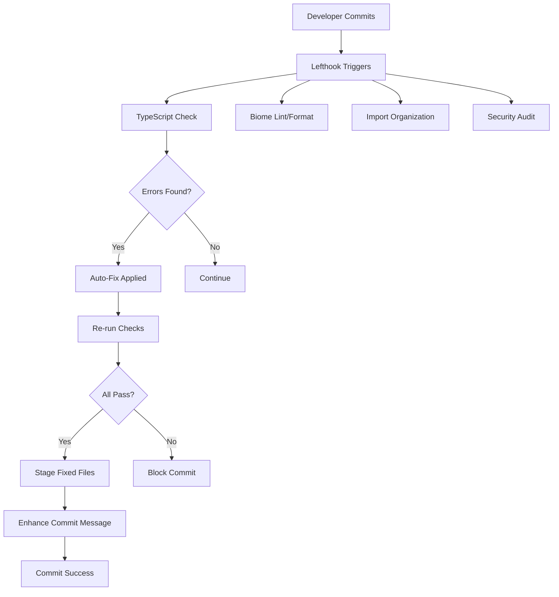

# 🚀 Automated Testing and Error Resolution System

## Overview

The Carmack Coder project now includes a comprehensive automated testing and error resolution system that automatically detects, fixes, and prevents TypeScript errors and code quality issues before they reach the repository.

## 🎯 Key Features

### ✅ **Automated TypeScript Error Resolution**
- **Real-time Detection**: Automatically detects TypeScript errors during pre-commit
- **Intelligent Fixing**: Uses pattern matching and AST transformations to fix common errors
- **Risk Assessment**: Categorizes fixes by risk level (low/medium/high)
- **Safe Defaults**: Only applies low-risk fixes by default

### ✅ **Enhanced Pre-Commit Hooks**
- **Comprehensive Validation**: TypeScript, Biome, Dafny, and security checks
- **Parallel Execution**: Fast, efficient processing of multiple checks
- **Auto-Staging**: Automatically stages fixed files back to git
- **Configurable**: Environment-specific hook configurations

### ✅ **Intelligent Commit Messages**
- **AI-Enhanced**: Automatically analyzes changes and enhances commit messages
- **Impact Analysis**: Provides detailed impact assessment and risk analysis
- **Quality Metrics**: Includes code complexity and error counts
- **Reasoning**: Infers and documents the reasoning behind changes

### ✅ **Import Organization**
- **Auto-Organization**: Sorts and organizes imports automatically
- **Unused Code Detection**: Identifies and removes unused imports/variables
- **Standard Formatting**: Follows consistent import ordering conventions

## 🛠️ Installation & Setup

### 1. Install Lefthook (if not already installed)
```bash
# Lefthook is already configured in the project
bun install
```

### 2. Install Git Hooks
```bash
bunx lefthook install
```

### 3. Configure (Optional)
Create `.carmack-precommit.json` in your project root:
```json
{
  "autoFix": true,
  "maxRiskLevel": "medium",
  "dryRun": false,
  "stagedFilesOnly": true,
  "excludePatterns": ["**/*.test.ts", "**/test/**"]
}
```

## 📋 Available Commands

### TypeScript Error Resolution
```bash
# Fix TypeScript errors in staged files
bun run pre-commit:check

# Fix all TypeScript files
bun run fix:types

# Dry run (show what would be fixed)
bun run fix:types:dry

# Fix specific files
bun run src/scripts/pre-commit-typescript.ts path/to/file.ts
```

### Import Organization
```bash
# Organize imports in all TypeScript files
bun run fix:imports

# Organize specific files
bun run src/scripts/pre-commit-imports.ts src/actors/*.ts
```

### Manual Hook Execution
```bash
# Run all pre-commit hooks manually
bunx lefthook run pre-commit

# Run specific hook
bunx lefthook run pre-commit typescript-check
```

## 🔧 How It Works

### Pre-Commit Workflow


### Error Resolution Process
1. **Detection**: TypeScript compiler identifies errors
2. **Classification**: Errors categorized by type and risk level
3. **Pattern Matching**: Applies appropriate fix patterns
4. **Validation**: Ensures fixes don't break functionality
5. **Staging**: Auto-stages corrected files

### Commit Message Enhancement
1. **Change Analysis**: Analyzes staged files and modifications
2. **Impact Assessment**: Calculates change impact and risk
3. **Quality Metrics**: Includes complexity and error metrics
4. **Reasoning Inference**: Determines likely reasoning for changes
5. **Enhancement**: Generates comprehensive commit message

## 🎛️ Configuration Options

### Risk Levels
- **Low**: Safe transformations (add type annotations, fix formatting)
- **Medium**: Moderate risk (add assertions, basic refactoring)
- **High**: Higher risk (property access fixes, complex transformations)

### Hook Categories
- **typescript**: TypeScript error detection and fixing
- **linting**: Code style and quality checks
- **formatting**: Code formatting with Biome
- **verification**: Dafny formal verification
- **security**: Security vulnerability scanning
- **performance**: Performance regression detection

### Environment Overrides
```yaml
# lefthook.yml environments
environments:
  development:
    skip: [security-check, performance-check]
  ci:
    skip: [commit-analytics, pattern-learning]
  production:
    skip: [] # All hooks enabled
```

## 📊 Error Types Handled

### TypeScript Errors
- **TS7006**: Parameter implicitly has 'any' type
- **TS7034**: Variable implicitly has 'any' type
- **TS2322**: Type assignment errors
- **TS2345**: Argument type errors
- **TS2531/2532**: Null/undefined errors
- **TS2339**: Property access errors
- **TS2355**: Missing return values

### Code Quality Issues
- **Unused imports**: Automatically removed
- **Import organization**: Sorted and grouped
- **Formatting inconsistencies**: Auto-corrected
- **Missing type annotations**: Added where safe

## 🧪 Testing

### Run TypeScript Error Resolver Tests
```bash
bun test test/actors/typescript-error-resolver.test.ts
```

### Test Pre-Commit Hooks
```bash
# Test with staged files
git add some-file.ts
bunx lefthook run pre-commit

# Test dry run
bun run fix:types:dry
```

### Validate Configuration
```bash
bunx lefthook dump
```

## 🔍 Monitoring & Debugging

### Enable Verbose Output
```bash
export LEFTHOOK_VERBOSE=1
bunx lefthook run pre-commit
```

### Check Hook Status
```bash
bunx lefthook version
bunx lefthook dump
```

### Debug TypeScript Issues
```bash
# Check TypeScript errors manually
bunx tsc --noEmit

# Run error resolver with verbose output
bun run src/scripts/pre-commit-typescript.ts --help
```

## 📈 Performance Metrics

### Typical Performance
- **TypeScript Check**: ~2-5 seconds for 50 files
- **Biome Formatting**: ~1-2 seconds for entire codebase
- **Import Organization**: ~1-3 seconds for 50 files
- **Total Pre-Commit Time**: ~5-15 seconds (depending on changes)

### Optimization Features
- **Parallel Execution**: Multiple hooks run simultaneously
- **Incremental Checks**: Only processes changed files
- **Smart Caching**: Avoids redundant operations
- **Risk-Based Filtering**: Skips high-risk fixes when appropriate

## 🚨 Troubleshooting

### Common Issues

#### Hook Not Running
```bash
# Reinstall hooks
bunx lefthook install --force
```

#### TypeScript Errors Not Fixed
```bash
# Check risk level setting
bun run fix:types --max-risk=high

# Run with verbose output
bun run src/scripts/pre-commit-typescript.ts --all-files --verbose
```

#### Commit Message Not Enhanced
```bash
# Check if prepare-commit-msg hook is installed
ls -la .git/hooks/prepare-commit-msg

# Test enhancement manually
echo "test commit" | bun run src/scripts/enhance-commit-message.ts /tmp/test-msg
```

### Getting Help
1. Check the verbose output with `LEFTHOOK_VERBOSE=1`
2. Review the configuration with `bunx lefthook dump`
3. Test individual scripts manually
4. Check the logs in `.lefthook/` directory

## 🔮 Future Enhancements

### Planned Features
- **AI-Powered Fixes**: More intelligent error resolution using LLM
- **Custom Pattern Learning**: System learns from manual fixes
- **Performance Regression Detection**: Automated performance monitoring
- **Security Vulnerability Auto-Fix**: Automatic security issue resolution
- **Cross-File Refactoring**: Intelligent refactoring across multiple files

### Integration Roadmap
- **CI/CD Integration**: Enhanced GitHub Actions workflows
- **IDE Extensions**: Real-time error fixing in VS Code
- **Team Dashboards**: Code quality metrics and trends
- **Automated PR Reviews**: AI-powered code review assistance

## 📚 Related Documentation

- [Lefthook Configuration](lefthook.yml)
- [TypeScript Error Resolver](src/actors/typescript-error-resolver.ts)
- [Pre-Commit Scripts](src/scripts/)
- [Test Suite](test/actors/typescript-error-resolver.test.ts)
- [Project Rules](.roo/rules/)

---

**🎉 The system is now active and will automatically improve your code quality with every commit!**

For questions or issues, check the troubleshooting section above or review the comprehensive test suite for usage examples.