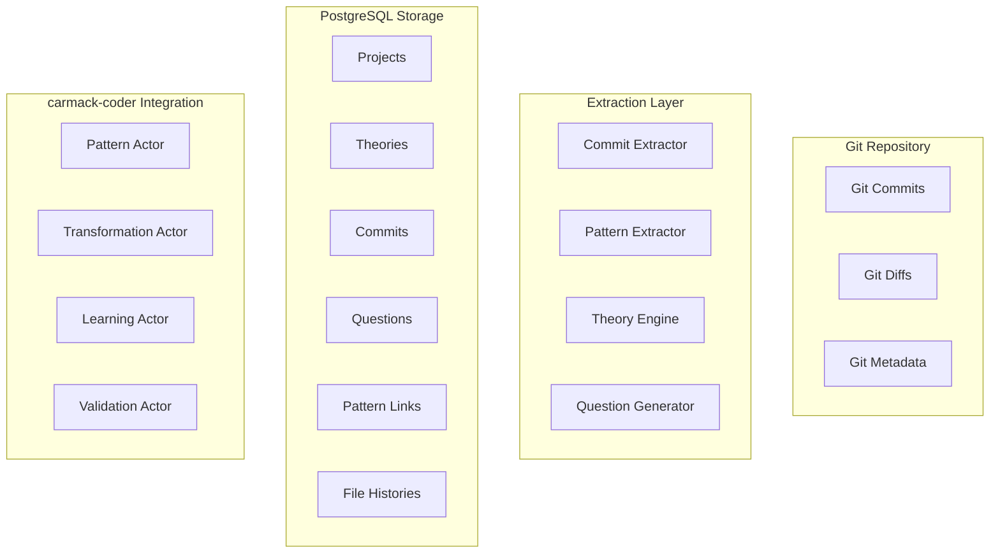

# CARMACK-CODER ENHANCEMENT PLAN: CLAUDE CODE MIGRATION & CODE ARCHAEOLOGY SYSTEM

## PLAN-EXEC-001: Executive Summary

### PLAN-EXEC-001-OBJ: Objectives
Transform carmack-coder from a powerful but complex code transformation system into a production-ready platform with enhanced developer experience, integrated code archaeology, and seamless Claude Code migration path.

### PLAN-EXEC-001-KEY: Key Insights
- **Current State**: 637-line XState machine with 96+ tests, achieving correctness but suffering from performance bottlenecks (0.33 files/second) and cognitive overload
- **Root Cause**: Sequential execution, scattered metadata (43 schemas), external process spawning, unbounded pattern learning
- **Solution**: Event-driven pipeline, unified context system, integrated validation, managed pattern lifecycle

### PLAN-EXEC-001-OUT: Expected Outcomes
- **Performance**: 10 files/second throughput (30x improvement)
- **Reliability**: 95% automatic error recovery, zero memory leaks
- **Usability**: <5 minutes onboarding, 90% reduction in configuration errors
- **Intelligence**: Automated "why" extraction from git history, context-aware transformations

## PLAN-ARCH-001: Core Architectural Revisions

### PLAN-ARCH-001-SEQ: Sequential State Machine → Event-Driven Pipeline

**Prerequisites**: Understanding of current 12-state sequential flow
**Attention Anchor**: The 637-line state machine creates 7.2s minimum overhead

```typescript
// PLAN-ARCH-001-IMPL: Implementation Strategy
EventDrivenPipeline {
  // Parallel execution tracks
  tracks: {
    analysis: [analyze, complexity, pattern_match],     // Can run concurrently
    transform: [transform, validate, fix],              // Sequential within track
    metadata: [collect, learn, persist]                 // Async background
  },
  
  // Coordination points (only where necessary)
  checkpoints: {
    pre_transform: "Ensure analysis complete",
    post_validate: "Ensure quality standards met",
    pre_commit: "Final approval gate"
  }
}
```

**Cross-References**: PLAN-IMPL-001 (implementation details), PLAN-METRICS-001 (performance targets)

### PLAN-ARCH-002: Scattered Metadata → Unified Context System

**Prerequisites**: Review of 43 Zod schemas across 6 files
**Attention Anchor**: Context is recomputed 3+ times per transformation

```typescript
// PLAN-ARCH-002-SCHEMA: Unified Schema Architecture
UnifiedContextSystem {
  // Hierarchical context layers
  layers: {
    global: { patterns, config, telemetry },           // Cached indefinitely
    project: { dependencies, style, history },         // Session cache
    file: { complexity, imports, ownership },          // TTL cache
    transform: { decisions, performance, errors }       // Transient
  },
  
  // Inheritance chain
  flow: "global → project → file → transformation",
  
  // Smart invalidation
  invalidation: "Event-based with dependency tracking"
}
```

**Cross-References**: PLAN-ARCHEO-002 (PostgreSQL schema), PLAN-IMPL-002 (migration strategy)

### PLAN-ARCH-003: Mode Selection → Adaptive Strategy Engine

**Prerequisites**: Current template → AST → LLM progression logic
**Attention Anchor**: Users don't understand mode selection, system can't learn from outcomes

```typescript
// PLAN-ARCH-003-ADAPT: Adaptive Mode Selection
AdaptiveStrategy {
  // Multi-factor decision making
  factors: {
    complexity: ComplexityMetrics,
    history: "Past success rates for similar code",
    patterns: "Available patterns and effectiveness",
    user_hint: "Explicit preferences or constraints",
    resources: "Current system load and deadlines"
  },
  
  // Transparent decisions
  output: {
    selected: { mode: Mode, confidence: number, rationale: string },
    alternatives: Array<{ mode: Mode, score: number, pros: string[], cons: string[] }>,
    explanation: "Human-readable reasoning"
  }
}
```

**Cross-References**: PLAN-ARCHEO-003 (historical pattern analysis), PLAN-INTEG-001 (user interface)

### PLAN-ARCH-004: External Validation → Integrated Engine

**Prerequisites**: Current validation spawns external processes
**Attention Anchor**: 6-24 second validation latency from process spawning

```typescript
// PLAN-ARCH-004-VAL: Integrated Validation
ValidationEngine {
  // In-process validators
  validators: {
    format: "Biome API (not CLI)",
    types: "TypeScript Compiler API",
    quality: "Built-in analyzers"
  },
  
  // Smart caching
  cache: Map<FileHash, ValidationResult>,
  
  // Parallel execution
  strategy: Promise.all([format, types, quality])
}
```

**Cross-References**: PLAN-IMPL-003 (API integration), PLAN-METRICS-002 (latency targets)

### PLAN-ARCH-005: Unbounded Learning → Managed Lifecycle

**Prerequisites**: Current pattern cache grows indefinitely
**Attention Anchor**: Self-modification risks system stability

```typescript
// PLAN-ARCH-005-LIFE: Pattern Lifecycle Management
PatternLifecycle {
  // Bounded storage tiers
  storage: {
    active: "LRU<1000> for hot patterns",
    learning: "RingBuffer<10000> for candidates",
    archive: "PostgreSQL for historical analysis"
  },
  
  // Quality gates
  promotion: {
    candidate_to_experimental: "10 successful uses",
    experimental_to_stable: "95% success rate",
    stable_to_core: "Manual approval + tests"
  },
  
  // Stability invariants
  invariants: [
    "Core patterns immutable",
    "Experimental patterns sandboxed",
    "Learning rate time-bounded"
  ]
}
```

**Cross-References**: PLAN-ARCHEO-004 (pattern storage), PLAN-IMPL-004 (migration process)

### PLAN-ARCH-006: Opaque Execution → Observable Pipeline

**Prerequisites**: Current lack of visibility into transformation process
**Attention Anchor**: Users need to understand and trust the system

```typescript
// PLAN-ARCH-006-OBS: Observability System
ObservabilityLayer {
  // Real-time status
  status_stream: {
    current_state: "What's happening now",
    progress: "Percentage and time estimates",
    decisions: "Why each choice was made",
    preview: "What will change before it happens"
  },
  
  // Intervention points
  breakpoints: {
    pre_transform: "Review and approve changes",
    post_validation: "Accept or reject fixes",
    pre_commit: "Final approval before git commit"
  },
  
  // Debugging support
  trace: {
    decision_tree: "Visual representation of choices",
    timeline: "What happened when",
    replay: "Re-run with different parameters"
  }
}
```

**Cross-References**: PLAN-INTEG-001 (UI design), PLAN-IMPL-003 (implementation)

### PLAN-ARCH-007: Monolithic Actors → Composable Units

**Prerequisites**: Current actor system architecture
**Attention Anchor**: Enable flexibility and custom workflows

```typescript
// PLAN-ARCH-007-COMP: Composable Architecture
TransformationUnits {
  // Atomic operations
  atoms: {
    ReadFile, ParseAST, MatchPattern,
    ApplyTemplate, ValidateTypes, FormatCode
  },
  
  // Composition rules
  combinators: {
    Sequence: [A, B, C],           // Run in order
    Parallel: [A | B | C],         // Run concurrently
    Conditional: A ? B : C,        // Branch on result
    Retry: A * 3                   // Retry with backoff
  },
  
  // Pre-built pipelines
  pipelines: {
    QuickFix: Parallel[Template, Format],
    SafeTransform: Sequence[Checkpoint, Transform, Validate, Commit],
    ExperimentalTry: Conditional[Transform ? Validate : Rollback]
  }
}
```

**Cross-References**: PLAN-IMPL-002 (decomposition strategy), PLAN-INTEG-002 (actor communication)

### PLAN-ARCH-008: Static Config → Dynamic Adaptation

**Prerequisites**: Current environment variable configuration
**Attention Anchor**: One size doesn't fit all transformation scenarios

```typescript
// PLAN-ARCH-008-DYN: Dynamic Configuration
AdaptiveConfig {
  // Base profiles
  profiles: {
    fast: "Optimize for speed, skip optional validation",
    safe: "Full validation, formal verification",
    balanced: "Adaptive based on risk assessment"
  },
  
  // Runtime adaptation
  adaptation: {
    load_balancing: "Adjust parallelism based on CPU/memory",
    timeout_scaling: "Increase timeouts under load",
    quality_tradeoff: "Reduce quality checks if behind schedule"
  },
  
  // Per-transformation overrides
  overrides: {
    file_type: "Different settings for .ts vs .js",
    complexity: "Stricter validation for complex files",
    history: "Relaxed settings for frequently-edited files"
  }
}
```

**Cross-References**: PLAN-IMPL-003 (configuration system), PLAN-INTEG-003 (user controls)

## PLAN-ARCHEO-001: Code Archaeology System Design

### PLAN-ARCHEO-001-GIT: Git Analysis Engine

**Prerequisites**: Access to git repository history
**Attention Anchor**: Extract "why" from commits while maintaining multiple theories

```typescript
// PLAN-ARCHEO-001-EXTRACT: Theory-Based Extraction
GitArchaeology {
  // Parallel theory tracking
  theories: Map<TheoryId, {
    hypothesis: string,
    confidence: 0.0-1.0,
    evidence: Evidence[],
    contradictions: Contradiction[],
    questions: Question[]
  }>,
  
  // Adaptive questioning
  question_priority: "impact * value / effort",
  
  // Theory evolution
  evolution: {
    strengthen: "New evidence aligns",
    weaken: "Contradictions found",
    fork: "Split incompatible aspects",
    merge: "Combine compatible theories"
  }
}
```

**Cross-References**: PLAN-ARCHEO-002 (storage schema), PLAN-INTEG-003 (user interface)

### PLAN-ARCHEO-002: PostgreSQL Schema Design

**Prerequisites**: PostgreSQL with Drizzle ORM
**Attention Anchor**: DDL comments serve as prompts for LLM understanding

```sql
-- PLAN-ARCHEO-002-DDL: Prompt-Optimized Schema
CREATE TABLE theories (
  id UUID PRIMARY KEY DEFAULT gen_random_uuid(),
  project_id UUID NOT NULL REFERENCES projects(id) ON DELETE CASCADE,
  -- PROMPT: Theories are hypotheses about WHY changes were made
  -- They evolve through evidence and user feedback
  scope_type TEXT NOT NULL CHECK (scope_type IN ('project', 'feature', 'file', 'commit')),
  scope_id TEXT NOT NULL,
  
  -- Theory content
  hypothesis TEXT NOT NULL,
  -- PROMPT: Natural language statement about developer intent
  confidence DECIMAL(3,2) CHECK (confidence BETWEEN 0 AND 1),
  evidence JSONB DEFAULT '[]',
  -- PROMPT: Evidence array: {type, reference, weight, description}
  contradictions JSONB DEFAULT '[]',
  
  -- Theory relationships
  parent_theory_id UUID REFERENCES theories(id),
  -- PROMPT: Theories form a reasoning tree
  
  status TEXT DEFAULT 'active' CHECK (status IN ('active', 'confirmed', 'refuted', 'merged')),
  created_at TIMESTAMPTZ DEFAULT NOW(),
  updated_at TIMESTAMPTZ DEFAULT NOW()
);

-- Bidirectional linking with auto-creation
CREATE TABLE pattern_links (
  id UUID PRIMARY KEY DEFAULT gen_random_uuid(),
  -- PROMPT: Relationships between code entities
  from_type TEXT CHECK (from_type IN ('commit', 'theory', 'pattern', 'file')),
  from_id UUID NOT NULL,
  to_type TEXT CHECK (to_type IN ('commit', 'theory', 'pattern', 'file')),
  to_id UUID NOT NULL,
  link_type TEXT CHECK (link_type IN (
    'causes', 'evolves_to', 'conflicts_with', 'depends_on',
    'similar_to', 'refactors', 'fixes', 'implements'
  )),
  confidence DECIMAL(3,2) DEFAULT 0.5,
  evidence JSONB DEFAULT '[]',
  created_at TIMESTAMPTZ DEFAULT NOW(),
  CONSTRAINT unique_link UNIQUE (from_type, from_id, to_type, to_id, link_type)
);

-- Trigger for bidirectional links
CREATE OR REPLACE FUNCTION create_bidirectional_link()
RETURNS TRIGGER AS $$
BEGIN
  -- Skip if already inverse
  IF NEW.link_type LIKE '%_inverse' THEN
    RETURN NEW;
  END IF;
  
  -- Determine inverse relationship
  DECLARE
    inverse_type TEXT;
  BEGIN
    inverse_type := CASE NEW.link_type
      WHEN 'causes' THEN 'caused_by'
      WHEN 'evolves_to' THEN 'evolved_from'
      WHEN 'depends_on' THEN 'dependency_of'
      WHEN 'fixes' THEN 'fixed_by'
      WHEN 'implements' THEN 'implemented_by'
      WHEN 'refactors' THEN 'refactored_by'
      -- Symmetric relationships
      WHEN 'conflicts_with' THEN 'conflicts_with'
      WHEN 'similar_to' THEN 'similar_to'
      ELSE NEW.link_type || '_inverse'
    END;
    
    -- Create inverse link
    INSERT INTO pattern_links (
      from_type, from_id, to_type, to_id, 
      link_type, confidence, evidence
    ) VALUES (
      NEW.to_type, NEW.to_id, NEW.from_type, NEW.from_id,
      inverse_type, NEW.confidence, NEW.evidence
    ) ON CONFLICT DO NOTHING;
  END;
  
  RETURN NEW;
END;
$$ LANGUAGE plpgsql;

CREATE TRIGGER ensure_bidirectional_links
AFTER INSERT ON pattern_links
FOR EACH ROW
EXECUTE FUNCTION create_bidirectional_link();
```

**Cross-References**: PLAN-IMPL-005 (database setup), PLAN-ARCHEO-003 (query patterns)

### PLAN-ARCHEO-003: Query Interface Design

**Prerequisites**: Understanding of carmack-coder pattern system
**Attention Anchor**: Queries must integrate with existing transformation pipeline

```typescript
// PLAN-ARCHEO-003-QUERY: Pattern-Compatible Queries
ArchaeologyQueries {
  // Find relevant history
  findHistory(file: string, mode: Mode): HistoricalContext,
  
  // Get evolution context
  getEvolution(patternId: string): PatternEvolution,
  
  // Resolve uncertainty
  getClarifications(threshold: number): Question[],
  
  // Discover patterns
  discoverPatterns(scope: Scope): HistoricalPattern[]
}
```

**Cross-References**: PLAN-INTEG-002 (actor integration), PLAN-IMPL-006 (query optimization)

### PLAN-ARCHEO-004: Data Flow Architecture

**Prerequisites**: Understanding of system components
**Attention Anchor**: Bidirectional flow between archaeology and transformation



**Cross-References**: PLAN-INTEG-003 (integration flow), PLAN-IMPL-005 (implementation steps)

## PLAN-IMPL-001: Implementation Phases

### PLAN-IMPL-001-P1: Phase 1 - Performance Critical (Weeks 1-2)

**Prerequisites**: Current codebase understanding
**Attention Anchor**: Address bottlenecks that block all other improvements

```typescript
// PLAN-IMPL-001-TASKS: Phase 1 Tasks
Phase1Tasks {
  // Task 1.1: Integrated Validation Engine
  validation: {
    action: "Replace CLI calls with API calls",
    files: ["src/actors/validation.ts"],
    impact: "6-24s → <1s validation"
  },
  
  // Task 1.2: Unified Context System  
  context: {
    action: "Create shared context cache",
    files: ["src/context/index.ts", "src/types.ts"],
    impact: "3x computation → 1x with caching"
  },
  
  // Task 1.3: Parallel Pipeline
  pipeline: {
    action: "Refactor state machine to event-driven",
    files: ["src/machine.ts", "src/pipeline.ts"],
    impact: "Sequential → parallel execution"
  }
}
```

**ultrathink**: Consider using multi-agent validation - Performance Engineer validates speed improvements, Data Architect validates schema changes, DX Designer validates usability

**Cross-References**: PLAN-METRICS-001 (success criteria), PLAN-INTEG-004 (testing strategy)

### PLAN-IMPL-002: Phase 2 - Stability Critical (Weeks 3-4)

**Prerequisites**: Phase 1 completion
**Attention Anchor**: Prevent resource exhaustion and enable modularity

```typescript
// PLAN-IMPL-002-TASKS: Phase 2 Tasks
Phase2Tasks {
  // Task 2.1: Pattern Lifecycle Management
  patterns: {
    action: "Implement bounded caches with lifecycle",
    files: ["src/patterns/lifecycle.ts"],
    impact: "Unbounded growth → managed resources"
  },
  
  // Task 2.2: Composable Units
  composition: {
    action: "Decompose actors into atomic operations",
    files: ["src/actors/*.ts", "src/operations/*.ts"],
    impact: "Monolithic → composable architecture"
  }
}
```

**Multi-Agent Workflow**: Deploy specialized agents for each subsystem refactoring

**Cross-References**: PLAN-ARCH-005 (pattern lifecycle), PLAN-METRICS-002 (stability metrics)

### PLAN-IMPL-003: Phase 3 - Usability Critical (Weeks 5-6)

**Prerequisites**: Stable performance foundation
**Attention Anchor**: Build user trust through transparency

```typescript
// PLAN-IMPL-003-TASKS: Phase 3 Tasks
Phase3Tasks {
  // Task 3.1: Observable Pipeline
  observability: {
    action: "Add status streams and intervention points",
    files: ["src/observability/*.ts"],
    impact: "Opaque → transparent operations"
  },
  
  // Task 3.2: Adaptive Configuration
  config: {
    action: "Implement dynamic, context-aware config",
    files: ["src/config/adaptive.ts"],
    impact: "Static → intelligent adaptation"
  }
}
```

**Cross-References**: PLAN-INTEG-001 (UI design), PLAN-METRICS-003 (UX metrics)

### PLAN-IMPL-004: Phase 4 - BAML Integration (Weeks 7-8)

**Prerequisites**: All core improvements complete
**Attention Anchor**: Seamless integration without disrupting existing flows

```typescript
// PLAN-IMPL-004-TASKS: Phase 4 Tasks
Phase4Tasks {
  // Task 4.1: BAML Actor Implementation
  baml: {
    action: "Replace LLM provider with BAML",
    files: ["src/actors/baml-transformation.ts"],
    impact: "Direct API → BAML abstraction"
  },
  
  // Task 4.2: Migration Tooling
  migration: {
    action: "Build Claude Code migration tools",
    files: ["src/migration/*.ts"],
    impact: "Manual migration → automated transition"
  }
}
```

**Cross-References**: PLAN-INTEG-005 (BAML specs), PLAN-METRICS-004 (migration success)

## PLAN-INTEG-001: Integration Specifications

### PLAN-INTEG-001-UI: User Interface Integration

**Prerequisites**: Current CLI and workflow understanding
**Attention Anchor**: Progressive disclosure prevents overwhelming users

```typescript
// PLAN-INTEG-001-FLOW: UI Flow Design
UserInterface {
  // Progressive complexity
  modes: {
    simple: "Just transform my code",
    advanced: "Let me configure details",
    expert: "Full control over pipeline"
  },
  
  // Intervention points
  breakpoints: {
    preview: "Show changes before applying",
    approve: "Confirm risky transformations",
    rollback: "Undo with explanation"
  }
}
```

### PLAN-INTEG-002: Actor System Integration

**Prerequisites**: Current actor architecture
**Attention Anchor**: Maintain actor isolation while enabling communication

```typescript
// PLAN-INTEG-002-COMM: Actor Communication
ActorIntegration {
  // Shared context access
  context: "Read from unified cache",
  
  // Event-based coordination
  events: "Publish progress and decisions",
  
  // Error boundaries
  isolation: "Failures don't cascade"
}
```

### PLAN-INTEG-003: Code Archaeology Integration

**Prerequisites**: Archaeology system design
**Attention Anchor**: Historical context enhances transformation decisions

```typescript
// PLAN-INTEG-003-FLOW: Archaeology Data Flow
ArchaeologyFlow {
  // Before transformation
  pre: "Query historical patterns",
  
  // During transformation
  during: "Match against past successes",
  
  // After transformation
  post: "Update pattern effectiveness"
}
```

### PLAN-INTEG-004: Testing Strategy

**Prerequisites**: Current test suite understanding
**Attention Anchor**: Maintain 96+ test coverage while refactoring

```typescript
// PLAN-INTEG-004-TEST: Testing Approach
TestingStrategy {
  // Unit tests
  units: "Test atomic operations in isolation",
  
  // Integration tests
  integration: "Test actor communication and context flow",
  
  // Performance tests
  performance: "Validate 10 files/second target",
  
  // Chaos tests
  chaos: "Validate 95% recovery rate"
}
```

### PLAN-INTEG-005: BAML Integration Specification

**Prerequisites**: BAML documentation and API
**Attention Anchor**: Maintain provider abstraction for flexibility

```typescript
// PLAN-INTEG-005-BAML: BAML Integration
BAMLIntegration {
  // Provider abstraction
  interface: "Maintain existing LLM provider interface",
  
  // BAML-specific features
  features: {
    structured_output: "Use BAML's type-safe responses",
    prompt_management: "Centralize prompts in BAML",
    versioning: "Track prompt versions"
  },
  
  // Migration path
  migration: "Gradual cutover with feature flags"
}
```

## PLAN-METRICS-001: Success Metrics

### PLAN-METRICS-001-PERF: Performance Metrics

**Target**: 10 files/second throughput
**Measurement**: End-to-end transformation time
**Validation**: Load testing with 10,000 files

```typescript
// PLAN-METRICS-001-BENCH: Performance Benchmarks
PerformanceBenchmarks {
  // Current baseline
  baseline: {
    throughput: "0.33 files/second",
    latency: "3000ms average",
    memory: "100MB per 1000 files"
  },
  
  // Target metrics
  targets: {
    throughput: "10 files/second",
    latency: "<500ms average",
    memory: "<50MB per 1000 files"
  },
  
  // Test scenarios
  scenarios: [
    "Single file transformation",
    "Batch of 100 files",
    "Large codebase (10,000 files)",
    "Concurrent users (10 parallel)"
  ]
}
```

### PLAN-METRICS-002: Reliability Metrics

**Target**: 95% automatic recovery
**Measurement**: Failure recovery rate
**Validation**: Chaos testing scenarios

```typescript
// PLAN-METRICS-002-REL: Reliability Targets
ReliabilityMetrics {
  // Error recovery
  recovery: {
    automatic: "95% of failures recover without intervention",
    manual: "5% require user decision",
    data_loss: "0% data loss in any scenario"
  },
  
  // Stability
  stability: {
    memory_leaks: "Zero leaks over 24-hour operation",
    pattern_degradation: "No degradation over 1M transformations",
    crash_rate: "<0.1% of transformations"
  }
}
```

### PLAN-METRICS-003: Usability Metrics

**Target**: <5 minutes to first success
**Measurement**: New user onboarding time
**Validation**: User study with 10 developers

```typescript
// PLAN-METRICS-003-UX: Usability Targets
UsabilityMetrics {
  // Onboarding
  onboarding: {
    first_success: "<5 minutes from install",
    configuration_errors: "90% reduction",
    documentation_clarity: "8/10 user rating"
  },
  
  // Daily use
  daily_use: {
    command_complexity: "1-2 commands for common tasks",
    error_understanding: "95% of errors have clear fix",
    workflow_integration: "Works with existing tools"
  }
}
```

### PLAN-METRICS-004: Intelligence Metrics

**Target**: Accurate "why" extraction
**Measurement**: Theory accuracy vs developer intent
**Validation**: User feedback on extracted insights

```typescript
// PLAN-METRICS-004-INT: Intelligence Targets
IntelligenceMetrics {
  // Code archaeology
  archaeology: {
    theory_accuracy: "80% align with developer intent",
    question_efficiency: "<5 questions to resolve uncertainty",
    pattern_discovery: "90% of recurring patterns identified"
  },
  
  // Adaptive behavior
  adaptation: {
    mode_selection: "95% optimal mode choice",
    learning_speed: "Patterns recognized within 10 uses",
    context_relevance: "90% of historical context useful"
  }
}
```

## PLAN-APPEND-001: Advanced Techniques

### PLAN-APPEND-001-ULTRA: ultrathink Usage

Deploy ultrathink for:
- Complex architectural decisions requiring deep reasoning
- Performance/usability tradeoff analysis
- Multi-perspective reconciliation
- System design validation

```typescript
// PLAN-APPEND-001-ULTRA-USAGE: ultrathink Integration Points
UltrathinkUsage {
  // Architectural decisions
  architecture: "When revising core system components",
  
  // Tradeoff analysis
  tradeoffs: "When balancing competing concerns",
  
  // Integration design
  integration: "When designing component interactions",
  
  // Performance optimization
  optimization: "When identifying bottleneck solutions"
}
```

### PLAN-APPEND-001-AGENT: Multi-Agent Workflows

Use specialized agents for:
- Performance analysis (Performance Engineer)
- Schema design (Data Architect)  
- UX evaluation (DX Designer)
- Integration testing (QA Engineer)

```typescript
// PLAN-APPEND-001-AGENT-WORKFLOWS: Multi-Agent Patterns
MultiAgentWorkflows {
  // Analysis phase
  analysis: {
    agents: ["Performance Engineer", "Data Architect", "DX Designer"],
    coordination: "Parallel analysis → Reconciliation agent",
    output: "Unified recommendations"
  },
  
  // Implementation phase
  implementation: {
    agents: ["Implementation Lead", "Code Reviewer", "Test Engineer"],
    coordination: "Sequential with checkpoints",
    output: "Validated implementation"
  },
  
  // Validation phase
  validation: {
    agents: ["QA Engineer", "Performance Tester", "User Tester"],
    coordination: "Parallel validation → Integration tester",
    output: "Quality assurance report"
  }
}
```

### PLAN-APPEND-001-MODEL: Model Selection Strategy

- **Claude Opus 4**: Complex reasoning, architectural decisions, multi-agent reconciliation
- **Claude Sonnet 4**: Implementation tasks, code generation, routine analysis

```typescript
// PLAN-APPEND-001-MODEL-SELECTION: Model Usage Guidelines
ModelSelection {
  // Claude Opus 4
  opus: {
    use_for: [
      "Architectural design and reasoning",
      "Complex tradeoff analysis",
      "Multi-agent coordination",
      "System-wide refactoring"
    ],
    avoid_for: ["Simple code generation", "Routine tasks"]
  },
  
  // Claude Sonnet 4
  sonnet: {
    use_for: [
      "Code implementation",
      "Test writing",
      "Documentation",
      "Bug fixes"
    ],
    avoid_for: ["Complex reasoning", "Architecture decisions"]
  }
}
```

### PLAN-APPEND-001-CONTEXT: Context Management

Strategies for maintaining context across long implementation:

```typescript
// PLAN-APPEND-001-CONTEXT-MGMT: Context Strategies
ContextManagement {
  // Compression techniques
  compression: {
    summarization: "Periodic summary of completed work",
    reference_ids: "Use PLAN-XXX-YYY for cross-references",
    state_tracking: "Maintain implementation state in todos"
  },
  
  // Expansion techniques
  expansion: {
    detail_retrieval: "Expand compressed references on demand",
    context_refresh: "Reload relevant sections when needed",
    state_recovery: "Reconstruct context from checkpoints"
  },
  
  // Handoff strategies
  handoff: {
    session_summary: "Create summary for next session",
    todo_state: "Update todo list with current progress",
    next_steps: "Clear documentation of what comes next"
  }
}
```

## PLAN-APPEND-002: Risk Mitigation

### PLAN-APPEND-002-RISKS: Identified Risks and Mitigations

```typescript
// PLAN-APPEND-002-RISK-MATRIX: Risk Analysis
RiskMatrix {
  // Technical risks
  technical: {
    complexity_explosion: {
      risk: "Refactoring creates more complexity",
      mitigation: "Incremental changes with validation",
      monitoring: "Complexity metrics before/after"
    },
    performance_regression: {
      risk: "Changes degrade performance",
      mitigation: "Continuous benchmarking",
      monitoring: "Automated performance tests"
    }
  },
  
  // Operational risks
  operational: {
    migration_failure: {
      risk: "Users can't migrate from Claude Code",
      mitigation: "Compatibility layer and tooling",
      monitoring: "User success metrics"
    },
    adoption_resistance: {
      risk: "Too complex for users",
      mitigation: "Progressive disclosure UI",
      monitoring: "Onboarding success rate"
    }
  }
}
```

## PLAN-APPEND-003: Future Enhancements

### PLAN-APPEND-003-FUTURE: Post-Implementation Opportunities

```typescript
// PLAN-APPEND-003-ROADMAP: Future Roadmap
FutureEnhancements {
  // AI enhancements
  ai_features: {
    predictive_transformations: "Suggest changes before asked",
    natural_language_interface: "Describe desired changes in English",
    multi_model_ensemble: "Use multiple AI models for consensus"
  },
  
  // Collaboration features
  collaboration: {
    team_pattern_sharing: "Share learned patterns across team",
    review_integration: "Integrate with PR review process",
    conflict_resolution: "AI-mediated merge conflict resolution"
  },
  
  // Scale features
  scale: {
    distributed_processing: "Scale across multiple machines",
    incremental_transformation: "Transform only changed files",
    real_time_transformation: "Transform as you type"
  }
}
```

---

This comprehensive plan provides a complete roadmap for transforming carmack-coder into a production-ready system with integrated code archaeology and seamless Claude Code migration. The hierarchical ID system enables easy navigation and reference, while the phased implementation approach ensures manageable progress with measurable outcomes.