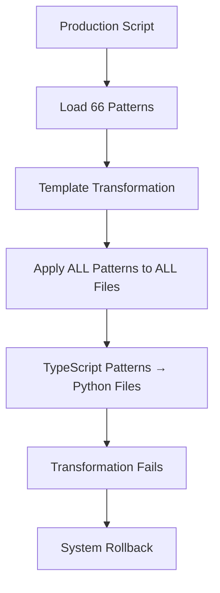
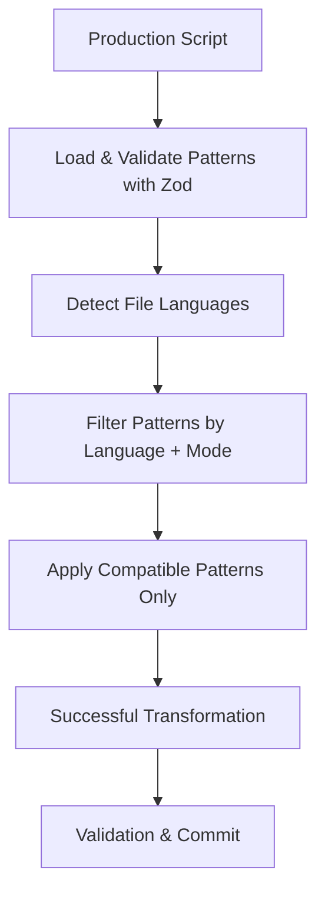

# Carmack Coder Transformation System Fix Plan

## Executive Summary

The transformation system is failing because patterns are not being properly filtered by language, causing TypeScript patterns to be applied to Python files. This results in transformation failures and rollbacks. The system needs comprehensive Zod schema validation and language-aware pattern filtering to handle multi-language repositories like NVIDIA TensorRT.

## Critical Issues Identified

### 1. **Language Mismatch Problem**
- **Issue**: TypeScript patterns being applied to Python files (`.py`)
- **Root Cause**: No language-based pattern filtering in template transformation
- **Impact**: All transformations fail and rollback
- **Files Affected**: `workspace\repository\demo\BERT\helpers\*.py`, `workspace\repository\demo\BERT\inference.py`

### 2. **Missing Zod Schema Validation**
- **Issue**: Pattern filtering lacks proper validation
- **Root Cause**: No runtime validation of pattern compatibility with target files
- **Impact**: Silent failures and incorrect pattern application

### 3. **Inadequate File Extension Mapping**
- **Issue**: No systematic mapping from file extensions to programming languages
- **Root Cause**: Hard-coded language detection logic
- **Impact**: Cannot properly filter patterns for different file types

## Detailed Technical Analysis

### Current System Flow


### Target System Flow


## Implementation Plan

### Phase 1: Core Infrastructure (High Priority)

#### 1.1 Enhanced File Extension Mapping System
**File**: `src/utils/language-detection.ts`
```typescript
// Zod schema for language mapping
const LanguageMappingSchema = z.object({
  extension: z.string(),
  language: z.string(),
  aliases: z.array(z.string()).default([]),
  framework: z.string().optional(),
});

// Comprehensive mapping
const FILE_EXTENSION_MAP = {
  '.py': { language: 'python', aliases: ['py'] },
  '.ts': { language: 'typescript', aliases: ['ts'] },
  '.js': { language: 'javascript', aliases: ['js'] },
  '.cpp': { language: 'cpp', aliases: ['c++', 'cxx'] },
  '.cu': { language: 'cuda', aliases: ['cuda'] },
  '.cuh': { language: 'cuda', aliases: ['cuda'] },
  // ... comprehensive mapping
};
```

#### 1.2 Pattern Filtering with Zod Validation
**File**: `src/utils/pattern-filtering.ts`
```typescript
// Enhanced pattern filtering schema
const PatternFilterRequestSchema = z.object({
  patterns: z.array(AstPatternSchema),
  targetFiles: z.array(z.string()),
  mode: TransformationModeSchema,
  strictLanguageMatching: z.boolean().default(true),
});

// Language-aware pattern filtering
export function filterPatternsByLanguageAndMode(
  patterns: AstPattern[],
  targetFiles: string[],
  mode: TransformationMode
): AstPattern[] {
  // Validate input with Zod
  const request = PatternFilterRequestSchema.parse({
    patterns,
    targetFiles,
    mode,
  });
  
  // Detect languages from files
  const targetLanguages = new Set(
    targetFiles.map(detectLanguageFromFile)
  );
  
  // Filter patterns
  return patterns.filter(pattern => {
    // Mode compatibility
    const modeMatch = pattern.mode === mode || 
                     (!pattern.mode && mode === 'template');
    
    // Language compatibility
    const languageMatch = targetLanguages.has(pattern.language);
    
    return modeMatch && languageMatch;
  });
}
```

### Phase 2: Transformation Actor Enhancement (High Priority)

#### 2.1 Template Transformation Fix
**File**: `src/actors/transformation.ts` (Lines 96-103)
```typescript
// BEFORE (Current - Broken)
const templatePatterns = patterns.filter(
  (p) =>
    p.complexity <= 3 &&
    (p.riskLevel === 'low' || p.riskLevel === 'medium') &&
    (p.mode === 'template' || !p.mode)
);

// AFTER (Fixed with Language Filtering)
const templatePatterns = filterPatternsByLanguageAndMode(
  patterns.filter(p => 
    p.complexity <= 3 &&
    (p.riskLevel === 'low' || p.riskLevel === 'medium')
  ),
  files,
  'template'
);
```

#### 2.2 Enhanced Error Handling
```typescript
// Add comprehensive error reporting
const TransformationErrorSchema = z.object({
  code: z.string(),
  message: z.string(),
  file: z.string().optional(),
  pattern: z.string().optional(),
  language: z.string().optional(),
  expectedLanguage: z.string().optional(),
  context: z.record(z.unknown()).optional(),
});

export class TransformationError extends Error {
  constructor(
    public readonly errorInfo: z.infer<typeof TransformationErrorSchema>
  ) {
    super(errorInfo.message);
    this.name = 'TransformationError';
  }
}
```

### Phase 3: Production Pipeline Integration (Medium Priority)

#### 3.1 Enhanced Pattern Loading
**File**: `production.ts`
```typescript
// Load patterns with validation and language detection
const patterns = await loadAllPatterns(
  './patterns.json',
  './src/patterns/enhanced-templates.json'
);

// Validate pattern compatibility with target files
const validatedPatterns = validatePatternCompatibility(
  patterns,
  eligibleFiles
);

console.log(`📋 Loaded ${validatedPatterns.length} compatible patterns`);
```

#### 3.2 Diagnostic Reporting
```typescript
// Add detailed transformation diagnostics
const diagnostics = {
  totalPatterns: patterns.length,
  compatiblePatterns: validatedPatterns.length,
  languageDistribution: getLanguageDistribution(eligibleFiles),
  patternDistribution: getPatternDistribution(validatedPatterns),
  potentialIssues: identifyPotentialIssues(validatedPatterns, eligibleFiles),
};

console.log('🔍 Transformation Diagnostics:', diagnostics);
```

### Phase 4: Comprehensive Testing (Medium Priority)

#### 4.1 Multi-Language Test Suite
**File**: `test/integration/multi-language-transformation.test.ts`
```typescript
describe('Multi-Language Transformation', () => {
  test('should filter patterns correctly for Python files', async () => {
    const pythonFiles = ['test.py', 'module.py'];
    const patterns = await loadAllPatterns();
    
    const filtered = filterPatternsByLanguageAndMode(
      patterns,
      pythonFiles,
      'template'
    );
    
    // Verify only Python patterns are included
    expect(filtered.every(p => p.language === 'python')).toBe(true);
  });
  
  test('should handle mixed language repositories', async () => {
    const mixedFiles = ['app.py', 'utils.ts', 'kernel.cu'];
    // Test implementation
  });
});
```

### Phase 5: Documentation and Monitoring (Low Priority)

#### 5.1 Enhanced Logging
```typescript
// Structured logging with Zod validation
const LogEntrySchema = z.object({
  timestamp: z.string(),
  level: z.enum(['debug', 'info', 'warn', 'error']),
  component: z.string(),
  message: z.string(),
  context: z.record(z.unknown()).optional(),
});

export function logTransformationEvent(
  level: 'debug' | 'info' | 'warn' | 'error',
  message: string,
  context?: Record<string, unknown>
) {
  const entry = LogEntrySchema.parse({
    timestamp: new Date().toISOString(),
    level,
    component: 'transformation',
    message,
    context,
  });
  
  console.log(`[${entry.level.toUpperCase()}] ${entry.message}`, entry.context);
}
```

## Implementation Priority Matrix

| Task | Priority | Effort | Impact | Dependencies |
|------|----------|--------|--------|--------------|
| Language Detection System | **HIGH** | Medium | High | None |
| Pattern Filtering Fix | **HIGH** | Low | High | Language Detection |
| Template Transformation Fix | **HIGH** | Low | High | Pattern Filtering |
| Zod Schema Validation | **HIGH** | Medium | High | None |
| Error Handling Enhancement | Medium | Medium | Medium | Zod Schemas |
| Production Pipeline Integration | Medium | Low | Medium | Core Fixes |
| Multi-Language Testing | Medium | High | Medium | All Core |
| Documentation & Monitoring | Low | Medium | Low | All Above |

## Risk Assessment

### High Risk Items
1. **Breaking Changes**: Pattern filtering changes may affect existing functionality
2. **Performance Impact**: Additional validation may slow down transformations
3. **Compatibility**: New Zod schemas must be backward compatible

### Mitigation Strategies
1. **Gradual Rollout**: Implement feature flags for new filtering logic
2. **Performance Testing**: Benchmark before/after performance
3. **Comprehensive Testing**: Test with multiple language combinations

## Success Criteria

### Immediate Success (Phase 1-2)
- [ ] Python files no longer receive TypeScript patterns
- [ ] Transformations complete without rollback
- [ ] All patterns validated with Zod schemas
- [ ] Language detection works for all supported file types

### Long-term Success (Phase 3-5)
- [ ] Multi-language repositories transform successfully
- [ ] Comprehensive error reporting and diagnostics
- [ ] Performance maintains acceptable levels
- [ ] System handles new languages easily

## Next Steps

1. **Immediate Action**: Implement language detection system
2. **Quick Win**: Fix template transformation pattern filtering
3. **Validation**: Add Zod schema validation throughout
4. **Testing**: Create comprehensive test suite
5. **Monitoring**: Add detailed logging and diagnostics

This plan addresses the core transformation failure while establishing a robust foundation for multi-language code transformation with proper validation and error handling.

## Diagnostic Evidence

### Current System Issues
- **66 patterns loaded** but no language filtering applied
- **TypeScript patterns applied to Python files** causing failures
- **System rollback** occurs on every transformation attempt
- **No Zod validation** for pattern compatibility
- **Missing file extension mapping** for language detection

### Target Files Affected
```
workspace\repository\demo\BERT\helpers\calibrator.py
workspace\repository\demo\BERT\helpers\data_processing.py
workspace\repository\demo\BERT\helpers\tokenization.py
workspace\repository\demo\BERT\helpers\__init__.py
workspace\repository\demo\BERT\inference.py
```

### Pattern Distribution Analysis
- **Template patterns**: Need language filtering
- **AST patterns**: Need language filtering  
- **LLM patterns**: Need language filtering
- **Total patterns**: 58 (11 template, 25 AST, 22 LLM)
- **Languages supported**: TypeScript, JavaScript, C++, CUDA, Python

This comprehensive plan provides a roadmap to fix the transformation system and enable successful multi-language code transformations for repositories like NVIDIA TensorRT.