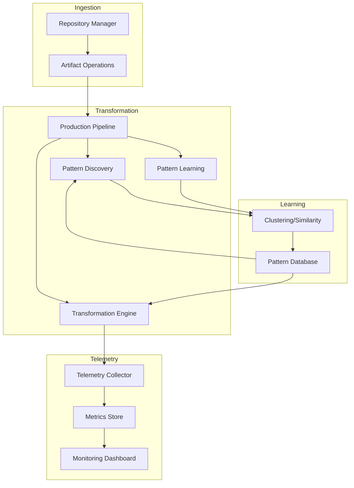

# Architecture Documentation

_Last updated: 2025-07-26_

## Unified Architecture Overview

This document provides a comprehensive, up-to-date overview of the Carmack Coder unified architecture, covering data models, API, database schema, telemetry, deployment, configuration, and integration test strategy. All core data models are defined and validated using Zod schemas in [`src/types/unified-schemas.ts`](src/types/unified-schemas.ts), ensuring strict type safety and runtime validation across all subsystems.

---

## Unified Data Models

All persistent and API-exposed entities are defined as Zod schemas:

- **RepositoryMetadataSchema**: Repository/project metadata (UUID, URL, name, owner, branch, languages, timestamps)
- **FileMetadataSchema**: File/document metadata (UUID, repositoryId, path, language, size, timestamps, embedding)
- **ASTNodeSchema**: AST/CST node representation (UUID, type, name, parentId, fileId, lines, children, properties)
- **VectorEmbeddingSchema**: Vector embedding payload (UUID, fileId, vector, model, createdAt)
- **PatternDefinitionSchema**: Pattern and transformation definition (UUID, name, description, language, astPattern, embedding, timestamps)
- **TelemetryEventSchema**: Telemetry event structure (UUID, timestamp, eventType, userId, repositoryId, fileId, patternId, details)

All API endpoints and database operations validate and serialize data using these schemas, guaranteeing consistency and extensibility.

---

## Modular API Structure

Each resource is mapped to a dedicated route file and Zod schema:

- [`src/api/routes/repository.ts`](src/api/routes/repository.ts): CRUD for repositories
- [`src/api/routes/file.ts`](src/api/routes/file.ts): CRUD for files
- [`src/api/routes/pattern.ts`](src/api/routes/pattern.ts): CRUD for patterns
- [`src/api/routes/vector.ts`](src/api/routes/vector.ts): CRUD for vector embeddings
- [`src/api/routes/telemetry.ts`](src/api/routes/telemetry.ts): CRUD for telemetry events

All handlers use `.safeParse` for input validation and return type-safe responses. The API server (`src/api/server.ts`) composes all routes and initializes telemetry with environment-driven configuration.

---

## Unified Database Schema

The relational schema in [`sql/migrations/002_unified_transformations_and_patterns.sql`](sql/migrations/002_unified_transformations_and_patterns.sql) is directly aligned with the Zod models:

- `repository_metadata`, `file_metadata`, `ast_node`, `vector_embedding`, `pattern_definition`, `transformation_result`, `pattern_embedding`, `telemetry_event`
- All foreign keys and constraints enforce referential integrity and support analytics across all subsystems.
- Indexes are defined for efficient lookups and analytics.

---

## Telemetry and Observability

The telemetry system (`src/telemetry/collector.ts`) provides:

- High-performance, privacy-compliant event collection with batching and anonymization
- Zod schema validation for all events
- Extensible metrics: pattern success, latency, memory, cache, mode selection, error recovery, quality delta, session tracking
- Integration with Prometheus and Grafana for monitoring and alerting
- Centralized configuration via environment variables and Docker Compose

---

## Deployment and Configuration

Deployment is orchestrated via [`docker-compose.yml`](docker-compose.yml):

- **PostgreSQL (pgvector)**: Unified knowledge graph and analytics storage
- **API Service**: Unified API, modular routes, telemetry integration
- **Ingestion Service**: Artifact and repository ingestion
- **Learning Service**: Pattern learning and recommendation
- **Telemetry Service**: Metrics collection and forwarding
- **Monitoring (Grafana/Prometheus)**: Observability and alerting

All services share a workspace volume and are configured via environment variables for portability and reproducibility.

---

## Integration Test Strategy

Integration tests (see [`test/integration/unified-dataflow-integration.test.ts`](test/integration/unified-dataflow-integration.test.ts)):

- Validate end-to-end data flow and schema conformance across API, ingestion, learning, and telemetry
- Use mocks for external dependencies and assert Zod schema compliance at each stage
- Ensure that all subsystems interoperate using the unified data models

---

## Extensibility and Formal Guarantees

- All external data is validated at runtime using Zod schemas, with strict TypeScript types for compile-time safety
- Modular structure enables independent evolution of API, ingestion, learning, and telemetry
- Telemetry and monitoring are integrated at every major flow for observability and feedback-driven optimization
- Integration tests provide provable guarantees of schema and data flow correctness

---

## References

- Unified Zod Schemas: [`src/types/unified-schemas.ts`](src/types/unified-schemas.ts)
- Database Schema: [`sql/migrations/002_unified_transformations_and_patterns.sql`](sql/migrations/002_unified_transformations_and_patterns.sql)
- API Entrypoint: [`src/api/server.ts`](src/api/server.ts)
- Telemetry Collector: [`src/telemetry/collector.ts`](src/telemetry/collector.ts)
- Integration Test: [`test/integration/unified-dataflow-integration.test.ts`](test/integration/unified-dataflow-integration.test.ts)
- Deployment: [`docker-compose.yml`](docker-compose.yml)

---

### Presentation

Configuration and external interfaces

**Components:**
- src\config\environment
- src\utils\config-validators

### Business Logic

Core business logic and state management

### Data

Data structures and transformation patterns

### Utilities

Shared utilities and helper functions

**Components:**
- src\actors\analysis
- src\actors\ast-grep-transformation
- src\actors\complexity
- src\actors\dafny
- src\actors\feedback-loop
- src\actors\git
- src\actors\llm-testing-framework
- src\actors\llm-transformation-enhanced
- src\actors\llm-transformation
- src\actors\pattern-discovery
- src\actors\pattern-learning
- src\actors\template-engine
- src\actors\transformation-enhanced
- src\actors\transformation
- src\actors\typescript-error-resolver
- src\actors\validation
- src\docs\ast-analyzer
- src\docs\cli
- src\docs\generator
- src\docs\index
- src\docs\types
- src\example
- src\learning\clustering
- src\learning\effectiveness-scorer
- src\learning\index
- src\learning\nlp
- src\learning\recommendation-engine
- src\learning\reinforcement
- src\learning\similarity
- src\learning\statistics
- src\learning\types
- src\llm-annotation\analyzer
- src\llm-annotation\index
- src\llm-annotation\types
- src\machine
- src\pipeline\production-pipeline
- src\providers\llm-providers
- src\repository-manager
- src\scripts\enhance-commit-message
- src\scripts\pre-commit-imports
- src\scripts\pre-commit-typescript
- src\telemetry\collector
- src\telemetry\index
- src\telemetry\integration
- src\telemetry\types
- src\test-e2e-function
- src\types
- src\utils\index
- src\utils\language-detection
- src\utils\pattern-filtering
- src\utils\yaml-handler

## Components

### src\actors\analysis

**Type:** utility

**File:** `src\actors\analysis.ts`

utility component

**Dependencies:**
- xstate
- zod

### src\actors\ast-grep-transformation

**Type:** utility

**File:** `src\actors\ast-grep-transformation.ts`

Enhanced AST-grep Transformation Engine

This engine provides the second tier in our speed hierarchy:
Template → **AST** → LLM

Features:
- True syntax tree-based pattern matching using AST-grep
- Semantic-aware transformations that understand code structure
- Context-sensitive replacements with scope analysis
- Multi-language support (TypeScript/JavaScript)
- Advanced pattern composition and chaining
- Performance-optimized batch processing

**Dependencies:**
- node:fs/promises
- @ast-grep/napi
- xstate
- zod

### src\actors\complexity

**Type:** utility

**File:** `src\actors\complexity.ts`

utility component

**Dependencies:**
- node:fs/promises
- xstate
- zod

### src\actors\dafny

**Type:** utility

**File:** `src\actors\dafny.ts`

utility component

**Dependencies:**
- node:fs/promises
- xstate
- zod

### src\actors\feedback-loop

**Type:** utility

**File:** `src\actors\feedback-loop.ts`

Feedback Loop System for Continuous Pattern Improvement

This system creates a continuous improvement cycle by:
- Collecting feedback from transformation results
- Analyzing pattern performance over time
- Automatically adjusting pattern confidence scores
- Identifying underperforming patterns for removal
- Discovering new patterns from successful transformations
- Optimizing pattern parameters based on usage data

**Dependencies:**
- xstate
- zod

### src\actors\git

**Type:** utility

**File:** `src\actors\git.ts`

utility component

**Dependencies:**
- simple-git
- xstate
- zod

### src\actors\llm-testing-framework

**Type:** utility

**File:** `src\actors\llm-testing-framework.ts`

Comprehensive LLM Testing Framework

This framework provides systematic testing capabilities for LLM transformations:
- Automated test case generation from patterns
- Property-based testing for transformation correctness
- Performance benchmarking and regression testing
- Integration testing across the entire pipeline
- Quality metrics and reporting

**Dependencies:**
- node:fs/promises
- node:path
- xstate
- zod

### src\actors\llm-transformation-enhanced

**Type:** utility

**File:** `src\actors\llm-transformation-enhanced.ts`

Enhanced LLM Transformation Actor

This module provides production-ready LLM-based code transformations using
the new provider system with real API integrations, fallback mechanisms,
context-aware transformations, advanced prompt engineering, and comprehensive
error handling with rollback capabilities.

**Dependencies:**
- node:fs/promises
- xstate
- zod
- ../providers/llm-providers.js

### src\actors\llm-transformation

**Type:** utility

**File:** `src\actors\llm-transformation.ts`

Comprehensive LLM Transformation System

This module implements production-ready LLM-based code transformations with:
- Multiple LLM provider support (OpenAI, Anthropic, Local models)
- Intelligent prompt engineering for code transformation
- Context-aware code analysis and transformation
- Safety mechanisms with validation and rollback
- Performance optimization with caching and batching

**Dependencies:**
- node:fs/promises
- xstate
- zod
- ../providers/llm-providers.js

### src\actors\pattern-discovery

**Type:** utility

**File:** `src\actors\pattern-discovery.ts`

Pattern Discovery and Automatic Pattern Generation Engine

This engine automatically discovers new transformation patterns by:
- Analyzing code repositories for common patterns
- Learning from successful transformations
- Extracting patterns from user feedback
- Generating new transformation rules
- Validating pattern effectiveness

**Dependencies:**
- node:fs/promises
- xstate
- zod
- fs

### src\actors\pattern-learning

**Type:** utility

**File:** `src\actors\pattern-learning.ts`

utility component

**Dependencies:**
- node:fs/promises
- xstate
- zod
- ../learning/clustering.ts
- ../learning/nlp.ts
- ../learning/reinforcement.ts
- ../learning/similarity.ts
- ../learning/statistics.ts

### src\actors\template-engine

**Type:** utility

**File:** `src\actors\template-engine.ts`

Enhanced Template Engine for Ultra-Fast Code Transformations

This engine implements the first tier of the speed hierarchy:
Template (fastest) → AST → LLM

Features:
- Multi-pattern template matching with variable capture
- Context-aware transformations with scoping analysis
- Batch processing for optimal performance
- Smart conflict resolution between patterns
- Semantic pattern recognition beyond simple regex

**Dependencies:**
- node:fs/promises
- xstate
- zod
- ../utils/pattern-filtering.js
- ../utils/language-detection.js

### src\actors\transformation-enhanced

**Type:** utility

**File:** `src\actors\transformation-enhanced.ts`

utility component

**Dependencies:**
- node:fs/promises
- node:path
- xstate
- zod
- ./ast-grep-transformation.ts
- ./complexity.ts
- ./llm-transformation-enhanced.ts
- ./template-engine.ts
- ./validation.ts

### src\actors\transformation

**Type:** utility

**File:** `src\actors\transformation.ts`

utility component

**Dependencies:**
- node:fs/promises
- @ast-grep/napi
- xstate
- zod
- ./llm-transformation-enhanced.js
- ../utils/pattern-filtering.js
- ../utils/language-detection.js

### src\actors\typescript-error-resolver

**Type:** utility

**File:** `src\actors\typescript-error-resolver.ts`

TypeScript Error Detection and Resolution Actor

Automatically detects and fixes TypeScript errors using AST transformations
and intelligent pattern matching. Integrates with the existing Carmack Coder
architecture for seamless error resolution.

**Dependencies:**
- node:child_process
- node:fs/promises
- xstate
- zod

### src\actors\validation

**Type:** utility

**File:** `src\actors\validation.ts`

utility component

**Dependencies:**
- node:child_process
- eslint
- xstate
- zod

### src\config\environment

**Type:** config

**File:** `src\config\environment.ts`

Environment Configuration Module for Carmack Coder

Provides type-safe environment variable loading and validation using Zod schemas.
Follows the project's principles of runtime validation and formal correctness.

**Dependencies:**
- zod

### src\docs\ast-analyzer

**Type:** utility

**File:** `src\docs\ast-analyzer.ts`

utility component

**Dependencies:**
- xstate
- zod
- $MODULE

### src\docs\cli

**Type:** utility

**File:** `src\docs\cli.ts`

CLI interface for the Documentation Generator

**Dependencies:**
- node:fs
- node:util
- chokidar
- zod
- ./generator.js
- ./types.js

### src\docs\generator

**Type:** utility

**File:** `src\docs\generator.ts`

utility component

**Dependencies:**
- xstate
- zod
- ./ast-analyzer.js
- ./types.js

### src\docs\index

**Type:** utility

**File:** `src\docs\index.ts`

Carmack Coder Documentation System

Comprehensive auto-documentation system with AST-grep integration
for generating API docs, architecture diagrams, pattern catalogs, and more.

**Dependencies:**
- ./generator.js

### src\docs\types

**Type:** utility

**File:** `src\docs\types.ts`

utility component

**Dependencies:**
- zod

### src\example

**Type:** utility

**File:** `src\example.ts`

utility component

### src\learning\clustering

**Type:** utility

**File:** `src\learning\clustering.ts`

Clustering Algorithms for Pattern Categorization

This module implements real clustering algorithms for intelligent pattern grouping
and categorization in the Carmack Coder system.

**Dependencies:**
- ./types.js

### src\learning\effectiveness-scorer

**Type:** utility

**File:** `src\learning\effectiveness-scorer.ts`

Pattern Effectiveness Scoring System

This module implements comprehensive effectiveness scoring for patterns
using real metrics, statistical analysis, and machine learning techniques.

**Dependencies:**
- zod
- ./statistics.js

### src\learning\index

**Type:** utility

**File:** `src\learning\index.ts`

Pattern Learning Machine Learning Algorithms

This module provides real machine learning algorithms for intelligent pattern discovery,
effectiveness scoring, and optimization in the Carmack Coder system.

Key Features:
- Clustering algorithms for pattern categorization
- Statistical analysis for pattern effectiveness
- Pattern similarity detection
- Reinforcement learning for optimization
- Natural language processing for pattern analysis

### src\learning\nlp

**Type:** utility

**File:** `src\learning\nlp.ts`

Natural Language Processing System for Pattern Analysis

Implements text analysis, sentiment analysis, keyword extraction,
and semantic understanding for pattern descriptions and user feedback.

**Dependencies:**
- zod

### src\learning\recommendation-engine

**Type:** utility

**File:** `src\learning\recommendation-engine.ts`

Recommendation request schema

**Dependencies:**
- zod

### src\learning\reinforcement

**Type:** utility

**File:** `src\learning\reinforcement.ts`

Reinforcement Learning System for Pattern Optimization

Implements Q-learning and policy gradient methods to optimize pattern selection
and recommendation based on historical effectiveness and context.

**Dependencies:**
- zod

### src\learning\similarity

**Type:** utility

**File:** `src\learning\similarity.ts`

utility component

**Dependencies:**
- zod
- ./types.ts

### src\learning\statistics

**Type:** utility

**File:** `src\learning\statistics.ts`

Statistical Analysis Tools for Pattern Metrics

This module provides real statistical algorithms for analyzing pattern effectiveness,
performance metrics, and learning insights in the Carmack Coder system.

### src\learning\types

**Type:** utility

**File:** `src\learning\types.ts`

Machine Learning Types for Pattern Learning System

**Dependencies:**
- zod

### src\llm-annotation\analyzer

**Type:** utility

**File:** `src\llm-annotation\analyzer.ts`

utility component

**Dependencies:**
- js-yaml
- xstate
- ./types.js

### src\llm-annotation\index

**Type:** utility

**File:** `src\llm-annotation\index.ts`

utility component

**Dependencies:**
- xstate
- ./analyzer.js
- ./types.js

### src\llm-annotation\types

**Type:** utility

**File:** `src\llm-annotation\types.ts`

utility component

**Dependencies:**
- zod

### src\machine

**Type:** utility

**File:** `src\machine.ts`

utility component

**Dependencies:**
- xstate
- ./actors/analysis.ts
- ./actors/ast-grep-transformation.ts
- ./actors/complexity.ts
- ./actors/dafny.ts
- ./actors/feedback-loop.ts
- ./actors/git.ts
- ./actors/llm-testing-framework.ts
- ./actors/llm-transformation-enhanced.ts
- ./actors/pattern-discovery.ts
- ./actors/pattern-learning.ts
- ./actors/template-engine.ts
- ./actors/transformation.ts
- ./actors/transformation-enhanced.ts
- ./actors/validation.ts
- ./types.ts

### src\pipeline\production-pipeline

**Type:** utility

**File:** `src\pipeline\production-pipeline.ts`

utility component

**Dependencies:**
- node:fs/promises
- node:path
- xstate
- zod
- ../actors/ast-grep-transformation.ts
- ../actors/complexity.ts
- ../actors/feedback-loop.ts
- ../actors/llm-testing-framework.ts
- ../actors/llm-transformation.ts
- ../actors/llm-transformation-enhanced.ts
- ../actors/pattern-discovery.ts
- ../actors/pattern-learning.ts
- ../actors/template-engine.ts
- ../actors/transformation-enhanced.ts
- ../actors/validation.ts
- ../docs/generator.ts

### src\providers\llm-providers

**Type:** utility

**File:** `src\providers\llm-providers.ts`

Real LLM Provider Integration System

This module provides production-ready LLM provider integrations with:
- Multiple provider support (OpenAI, Anthropic, OpenRouter, Ollama)
- Rate limiting and cost tracking
- Robust error handling and fallback mechanisms
- Provider-specific optimizations
- Context-aware prompt engineering

**Dependencies:**
- zod
- ../config/environment.js

### src\repository-manager

**Type:** utility

**File:** `src\repository-manager.ts`

utility component

**Dependencies:**
- xstate
- zod
- ./actors/git.js
- ./actors/pattern-learning.js
- ./machine.js
- ./types.js

### src\scripts\enhance-commit-message

**Type:** utility

**File:** `src\scripts\enhance-commit-message.ts`

utility component

**Dependencies:**
- node:child_process
- node:fs/promises
- node:path
- zod

### src\scripts\pre-commit-imports

**Type:** utility

**File:** `src\scripts\pre-commit-imports.ts`

utility component

**Dependencies:**
- node:fs/promises

### src\scripts\pre-commit-typescript

**Type:** utility

**File:** `src\scripts\pre-commit-typescript.ts`

utility component

**Dependencies:**
- node:child_process
- node:fs
- node:fs/promises
- node:path
- xstate
- ../actors/typescript-error-resolver.js

### src\telemetry\collector

**Type:** utility

**File:** `src\telemetry\collector.ts`

Core telemetry collection system for Carmack Coder
Provides high-performance, low-overhead metrics collection with privacy compliance

**Dependencies:**
- node:crypto
- node:events
- node:perf_hooks
- ./types.js

### src\telemetry\index

**Type:** utility

**File:** `src\telemetry\index.ts`

Telemetry system exports for Carmack Coder
Comprehensive observability and metrics collection

### src\telemetry\integration

**Type:** utility

**File:** `src\telemetry\integration.ts`

Telemetry integration for Carmack Coder transformation system
Provides comprehensive observability without impacting transformation performance

**Dependencies:**
- node:crypto
- node:perf_hooks
- ./collector.js

### src\telemetry\types

**Type:** utility

**File:** `src\telemetry\types.ts`

Telemetry system type definitions for Carmack Coder
Provides comprehensive observability into transformation effectiveness and performance

**Dependencies:**
- zod

### src\test-e2e-function

**Type:** utility

**File:** `src\test-e2e-function.ts`

Test function for end-to-end documentation system validation
@param testId - Unique identifier for this test
@returns Success confirmation message

### src\types

**Type:** utility

**File:** `src\types.ts`

utility component

**Dependencies:**
- zod

### src\utils\config-validators

**Type:** config

**File:** `src\utils\config-validators.ts`

Configuration-specific YAML validators for Carmack Coder

Provides type-safe validation for all configuration files used in the project

**Dependencies:**
- zod
- ./yaml-handler.js

### src\utils\index

**Type:** utility

**File:** `src\utils\index.ts`

Utility functions for the Carmack Coder system

**Dependencies:**
- node:fs/promises
- zod
- ../types.js

### src\utils\language-detection

**Type:** utility

**File:** `src\utils\language-detection.ts`

Language Detection System for Multi-Language Code Transformation

This module provides comprehensive language detection based on file extensions
and content analysis, with full Zod schema validation for type safety.

**Dependencies:**
- zod

### src\utils\pattern-filtering

**Type:** utility

**File:** `src\utils\pattern-filtering.ts`

Pattern Filtering System with Language Awareness and Zod Validation

This module provides comprehensive pattern filtering based on language compatibility,
transformation mode, complexity, and risk level with full Zod schema validation.

**Dependencies:**
- zod
- ../types.js
- ./language-detection.js

### src\utils\yaml-handler

**Type:** utility

**File:** `src\utils\yaml-handler.ts`

YAML Handler - Provably correct YAML processing with Zod validation

Following Carmack principles:
1. Type Safety First - Zod schemas for all operations
2. Error Resilience - Explicit error handling
3. Performance - Efficient parsing and serialization

**Dependencies:**
- node:fs/promises
- js-yaml
- zod

## Data Flow

The following diagram shows the data flow between components:

```mermaid
graph TD
  xstate[xstate] --> src_actors_analysis[src\actors\analysis]
  zod[zod] --> src_actors_analysis[src\actors\analysis]
  node_fs_promises[node:fs/promises] --> src_actors_ast_grep_transformation[src\actors\ast-grep-transformation]
  _ast_grep_napi[@ast-grep/napi] --> src_actors_ast_grep_transformation[src\actors\ast-grep-transformation]
  xstate[xstate] --> src_actors_ast_grep_transformation[src\actors\ast-grep-transformation]
  zod[zod] --> src_actors_ast_grep_transformation[src\actors\ast-grep-transformation]
  node_fs_promises[node:fs/promises] --> src_actors_complexity[src\actors\complexity]
  xstate[xstate] --> src_actors_complexity[src\actors\complexity]
  zod[zod] --> src_actors_complexity[src\actors\complexity]
  node_fs_promises[node:fs/promises] --> src_actors_dafny[src\actors\dafny]
  xstate[xstate] --> src_actors_dafny[src\actors\dafny]
  zod[zod] --> src_actors_dafny[src\actors\dafny]
  xstate[xstate] --> src_actors_feedback_loop[src\actors\feedback-loop]
  zod[zod] --> src_actors_feedback_loop[src\actors\feedback-loop]
  simple_git[simple-git] --> src_actors_git[src\actors\git]
  xstate[xstate] --> src_actors_git[src\actors\git]
  zod[zod] --> src_actors_git[src\actors\git]
  node_fs_promises[node:fs/promises] --> src_actors_llm_testing_framework[src\actors\llm-testing-framework]
  node_path[node:path] --> src_actors_llm_testing_framework[src\actors\llm-testing-framework]
  xstate[xstate] --> src_actors_llm_testing_framework[src\actors\llm-testing-framework]
  zod[zod] --> src_actors_llm_testing_framework[src\actors\llm-testing-framework]
  node_fs_promises[node:fs/promises] --> src_actors_llm_transformation_enhanced[src\actors\llm-transformation-enhanced]
  xstate[xstate] --> src_actors_llm_transformation_enhanced[src\actors\llm-transformation-enhanced]
  zod[zod] --> src_actors_llm_transformation_enhanced[src\actors\llm-transformation-enhanced]
  ___providers_llm_providers_js[../providers/llm-providers.js] --> src_actors_llm_transformation_enhanced[src\actors\llm-transformation-enhanced]
  node_fs_promises[node:fs/promises] --> src_actors_llm_transformation[src\actors\llm-transformation]
  xstate[xstate] --> src_actors_llm_transformation[src\actors\llm-transformation]
  zod[zod] --> src_actors_llm_transformation[src\actors\llm-transformation]
  ___providers_llm_providers_js[../providers/llm-providers.js] --> src_actors_llm_transformation[src\actors\llm-transformation]
  node_fs_promises[node:fs/promises] --> src_actors_pattern_discovery[src\actors\pattern-discovery]
  xstate[xstate] --> src_actors_pattern_discovery[src\actors\pattern-discovery]
  zod[zod] --> src_actors_pattern_discovery[src\actors\pattern-discovery]
  fs[fs] --> src_actors_pattern_discovery[src\actors\pattern-discovery]
  node_fs_promises[node:fs/promises] --> src_actors_pattern_learning[src\actors\pattern-learning]
  xstate[xstate] --> src_actors_pattern_learning[src\actors\pattern-learning]
  zod[zod] --> src_actors_pattern_learning[src\actors\pattern-learning]
  ___learning_clustering_ts[../learning/clustering.ts] --> src_actors_pattern_learning[src\actors\pattern-learning]
  ___learning_nlp_ts[../learning/nlp.ts] --> src_actors_pattern_learning[src\actors\pattern-learning]
  ___learning_reinforcement_ts[../learning/reinforcement.ts] --> src_actors_pattern_learning[src\actors\pattern-learning]
  ___learning_similarity_ts[../learning/similarity.ts] --> src_actors_pattern_learning[src\actors\pattern-learning]
  ___learning_statistics_ts[../learning/statistics.ts] --> src_actors_pattern_learning[src\actors\pattern-learning]
  node_fs_promises[node:fs/promises] --> src_actors_template_engine[src\actors\template-engine]
  xstate[xstate] --> src_actors_template_engine[src\actors\template-engine]
  zod[zod] --> src_actors_template_engine[src\actors\template-engine]
  ___utils_pattern_filtering_js[../utils/pattern-filtering.js] --> src_actors_template_engine[src\actors\template-engine]
  ___utils_language_detection_js[../utils/language-detection.js] --> src_actors_template_engine[src\actors\template-engine]
  node_fs_promises[node:fs/promises] --> src_actors_transformation_enhanced[src\actors\transformation-enhanced]
  node_path[node:path] --> src_actors_transformation_enhanced[src\actors\transformation-enhanced]
  xstate[xstate] --> src_actors_transformation_enhanced[src\actors\transformation-enhanced]
  zod[zod] --> src_actors_transformation_enhanced[src\actors\transformation-enhanced]
  __ast_grep_transformation_ts[./ast-grep-transformation.ts] --> src_actors_transformation_enhanced[src\actors\transformation-enhanced]
  __complexity_ts[./complexity.ts] --> src_actors_transformation_enhanced[src\actors\transformation-enhanced]
  __llm_transformation_enhanced_ts[./llm-transformation-enhanced.ts] --> src_actors_transformation_enhanced[src\actors\transformation-enhanced]
  __template_engine_ts[./template-engine.ts] --> src_actors_transformation_enhanced[src\actors\transformation-enhanced]
  __validation_ts[./validation.ts] --> src_actors_transformation_enhanced[src\actors\transformation-enhanced]
  node_fs_promises[node:fs/promises] --> src_actors_transformation[src\actors\transformation]
  _ast_grep_napi[@ast-grep/napi] --> src_actors_transformation[src\actors\transformation]
  xstate[xstate] --> src_actors_transformation[src\actors\transformation]
  zod[zod] --> src_actors_transformation[src\actors\transformation]
  __llm_transformation_enhanced_js[./llm-transformation-enhanced.js] --> src_actors_transformation[src\actors\transformation]
  ___utils_pattern_filtering_js[../utils/pattern-filtering.js] --> src_actors_transformation[src\actors\transformation]
  ___utils_language_detection_js[../utils/language-detection.js] --> src_actors_transformation[src\actors\transformation]
  node_child_process[node:child_process] --> src_actors_typescript_error_resolver[src\actors\typescript-error-resolver]
  node_fs_promises[node:fs/promises] --> src_actors_typescript_error_resolver[src\actors\typescript-error-resolver]
  xstate[xstate] --> src_actors_typescript_error_resolver[src\actors\typescript-error-resolver]
  zod[zod] --> src_actors_typescript_error_resolver[src\actors\typescript-error-resolver]
  node_child_process[node:child_process] --> src_actors_validation[src\actors\validation]
  eslint[eslint] --> src_actors_validation[src\actors\validation]
  xstate[xstate] --> src_actors_validation[src\actors\validation]
  zod[zod] --> src_actors_validation[src\actors\validation]
  zod[zod] --> src_config_environment[src\config\environment]
  xstate[xstate] --> src_docs_ast_analyzer[src\docs\ast-analyzer]
  zod[zod] --> src_docs_ast_analyzer[src\docs\ast-analyzer]
  _MODULE[$MODULE] --> src_docs_ast_analyzer[src\docs\ast-analyzer]
  node_fs[node:fs] --> src_docs_cli[src\docs\cli]
  node_util[node:util] --> src_docs_cli[src\docs\cli]
  chokidar[chokidar] --> src_docs_cli[src\docs\cli]
  zod[zod] --> src_docs_cli[src\docs\cli]
  __generator_js[./generator.js] --> src_docs_cli[src\docs\cli]
  __types_js[./types.js] --> src_docs_cli[src\docs\cli]
  xstate[xstate] --> src_docs_generator[src\docs\generator]
  zod[zod] --> src_docs_generator[src\docs\generator]
  __ast_analyzer_js[./ast-analyzer.js] --> src_docs_generator[src\docs\generator]
  __types_js[./types.js] --> src_docs_generator[src\docs\generator]
  __generator_js[./generator.js] --> src_docs_index[src\docs\index]
  zod[zod] --> src_docs_types[src\docs\types]
  __types_js[./types.js] --> src_learning_clustering[src\learning\clustering]
  zod[zod] --> src_learning_effectiveness_scorer[src\learning\effectiveness-scorer]
  __statistics_js[./statistics.js] --> src_learning_effectiveness_scorer[src\learning\effectiveness-scorer]
  zod[zod] --> src_learning_nlp[src\learning\nlp]
  zod[zod] --> src_learning_recommendation_engine[src\learning\recommendation-engine]
  zod[zod] --> src_learning_reinforcement[src\learning\reinforcement]
  zod[zod] --> src_learning_similarity[src\learning\similarity]
  __types_ts[./types.ts] --> src_learning_similarity[src\learning\similarity]
  zod[zod] --> src_learning_types[src\learning\types]
  js_yaml[js-yaml] --> src_llm_annotation_analyzer[src\llm-annotation\analyzer]
  xstate[xstate] --> src_llm_annotation_analyzer[src\llm-annotation\analyzer]
  __types_js[./types.js] --> src_llm_annotation_analyzer[src\llm-annotation\analyzer]
  xstate[xstate] --> src_llm_annotation_index[src\llm-annotation\index]
  __analyzer_js[./analyzer.js] --> src_llm_annotation_index[src\llm-annotation\index]
  __types_js[./types.js] --> src_llm_annotation_index[src\llm-annotation\index]
  zod[zod] --> src_llm_annotation_types[src\llm-annotation\types]
  xstate[xstate] --> src_machine[src\machine]
  __actors_analysis_ts[./actors/analysis.ts] --> src_machine[src\machine]
  __actors_ast_grep_transformation_ts[./actors/ast-grep-transformation.ts] --> src_machine[src\machine]
  __actors_complexity_ts[./actors/complexity.ts] --> src_machine[src\machine]
  __actors_dafny_ts[./actors/dafny.ts] --> src_machine[src\machine]
  __actors_feedback_loop_ts[./actors/feedback-loop.ts] --> src_machine[src\machine]
  __actors_git_ts[./actors/git.ts] --> src_machine[src\machine]
  __actors_llm_testing_framework_ts[./actors/llm-testing-framework.ts] --> src_machine[src\machine]
  __actors_llm_transformation_enhanced_ts[./actors/llm-transformation-enhanced.ts] --> src_machine[src\machine]
  __actors_pattern_discovery_ts[./actors/pattern-discovery.ts] --> src_machine[src\machine]
  __actors_pattern_learning_ts[./actors/pattern-learning.ts] --> src_machine[src\machine]
  __actors_template_engine_ts[./actors/template-engine.ts] --> src_machine[src\machine]
  __actors_transformation_ts[./actors/transformation.ts] --> src_machine[src\machine]
  __actors_transformation_enhanced_ts[./actors/transformation-enhanced.ts] --> src_machine[src\machine]
  __actors_validation_ts[./actors/validation.ts] --> src_machine[src\machine]
  __types_ts[./types.ts] --> src_machine[src\machine]
  node_fs_promises[node:fs/promises] --> src_pipeline_production_pipeline[src\pipeline\production-pipeline]
  node_path[node:path] --> src_pipeline_production_pipeline[src\pipeline\production-pipeline]
  xstate[xstate] --> src_pipeline_production_pipeline[src\pipeline\production-pipeline]
  zod[zod] --> src_pipeline_production_pipeline[src\pipeline\production-pipeline]
  ___actors_ast_grep_transformation_ts[../actors/ast-grep-transformation.ts] --> src_pipeline_production_pipeline[src\pipeline\production-pipeline]
  ___actors_complexity_ts[../actors/complexity.ts] --> src_pipeline_production_pipeline[src\pipeline\production-pipeline]
  ___actors_feedback_loop_ts[../actors/feedback-loop.ts] --> src_pipeline_production_pipeline[src\pipeline\production-pipeline]
  ___actors_llm_testing_framework_ts[../actors/llm-testing-framework.ts] --> src_pipeline_production_pipeline[src\pipeline\production-pipeline]
  ___actors_llm_transformation_ts[../actors/llm-transformation.ts] --> src_pipeline_production_pipeline[src\pipeline\production-pipeline]
  ___actors_llm_transformation_enhanced_ts[../actors/llm-transformation-enhanced.ts] --> src_pipeline_production_pipeline[src\pipeline\production-pipeline]
  ___actors_pattern_discovery_ts[../actors/pattern-discovery.ts] --> src_pipeline_production_pipeline[src\pipeline\production-pipeline]
  ___actors_pattern_learning_ts[../actors/pattern-learning.ts] --> src_pipeline_production_pipeline[src\pipeline\production-pipeline]
  ___actors_template_engine_ts[../actors/template-engine.ts] --> src_pipeline_production_pipeline[src\pipeline\production-pipeline]
  ___actors_transformation_enhanced_ts[../actors/transformation-enhanced.ts] --> src_pipeline_production_pipeline[src\pipeline\production-pipeline]
  ___actors_validation_ts[../actors/validation.ts] --> src_pipeline_production_pipeline[src\pipeline\production-pipeline]
  ___docs_generator_ts[../docs/generator.ts] --> src_pipeline_production_pipeline[src\pipeline\production-pipeline]
  zod[zod] --> src_providers_llm_providers[src\providers\llm-providers]
  ___config_environment_js[../config/environment.js] --> src_providers_llm_providers[src\providers\llm-providers]
  xstate[xstate] --> src_repository_manager[src\repository-manager]
  zod[zod] --> src_repository_manager[src\repository-manager]
  __actors_git_js[./actors/git.js] --> src_repository_manager[src\repository-manager]
  __actors_pattern_learning_js[./actors/pattern-learning.js] --> src_repository_manager[src\repository-manager]
  __machine_js[./machine.js] --> src_repository_manager[src\repository-manager]
  __types_js[./types.js] --> src_repository_manager[src\repository-manager]
  node_child_process[node:child_process] --> src_scripts_enhance_commit_message[src\scripts\enhance-commit-message]
  node_fs_promises[node:fs/promises] --> src_scripts_enhance_commit_message[src\scripts\enhance-commit-message]
  node_path[node:path] --> src_scripts_enhance_commit_message[src\scripts\enhance-commit-message]
  zod[zod] --> src_scripts_enhance_commit_message[src\scripts\enhance-commit-message]
  node_fs_promises[node:fs/promises] --> src_scripts_pre_commit_imports[src\scripts\pre-commit-imports]
  node_child_process[node:child_process] --> src_scripts_pre_commit_typescript[src\scripts\pre-commit-typescript]
  node_fs[node:fs] --> src_scripts_pre_commit_typescript[src\scripts\pre-commit-typescript]
  node_fs_promises[node:fs/promises] --> src_scripts_pre_commit_typescript[src\scripts\pre-commit-typescript]
  node_path[node:path] --> src_scripts_pre_commit_typescript[src\scripts\pre-commit-typescript]
  xstate[xstate] --> src_scripts_pre_commit_typescript[src\scripts\pre-commit-typescript]
  ___actors_typescript_error_resolver_js[../actors/typescript-error-resolver.js] --> src_scripts_pre_commit_typescript[src\scripts\pre-commit-typescript]
  node_crypto[node:crypto] --> src_telemetry_collector[src\telemetry\collector]
  node_events[node:events] --> src_telemetry_collector[src\telemetry\collector]
  node_perf_hooks[node:perf_hooks] --> src_telemetry_collector[src\telemetry\collector]
  __types_js[./types.js] --> src_telemetry_collector[src\telemetry\collector]
  node_crypto[node:crypto] --> src_telemetry_integration[src\telemetry\integration]
  node_perf_hooks[node:perf_hooks] --> src_telemetry_integration[src\telemetry\integration]
  __collector_js[./collector.js] --> src_telemetry_integration[src\telemetry\integration]
  zod[zod] --> src_telemetry_types[src\telemetry\types]
  zod[zod] --> src_types[src\types]
  zod[zod] --> src_utils_config_validators[src\utils\config-validators]
  __yaml_handler_js[./yaml-handler.js] --> src_utils_config_validators[src\utils\config-validators]
  node_fs_promises[node:fs/promises] --> src_utils_index[src\utils\index]
  zod[zod] --> src_utils_index[src\utils\index]
  ___types_js[../types.js] --> src_utils_index[src\utils\index]
  zod[zod] --> src_utils_language_detection[src\utils\language-detection]
  zod[zod] --> src_utils_pattern_filtering[src\utils\pattern-filtering]
  ___types_js[../types.js] --> src_utils_pattern_filtering[src\utils\pattern-filtering]
  __language_detection_js[./language-detection.js] --> src_utils_pattern_filtering[src\utils\pattern-filtering]
  node_fs_promises[node:fs/promises] --> src_utils_yaml_handler[src\utils\yaml-handler]
  js_yaml[js-yaml] --> src_utils_yaml_handler[src\utils\yaml-handler]
  zod[zod] --> src_utils_yaml_handler[src\utils\yaml-handler]
```


## System Data Flow Overview



- **Ingestion**: Repository manager extracts artifacts and stores them via artifact operations.
- **Transformation**: Production pipeline orchestrates pattern discovery, learning, and code transformation.
- **Learning**: Pattern discovery and learning modules update the pattern database using clustering and similarity.
- **Telemetry**: All transformation and learning events are tracked by the telemetry collector, feeding metrics and monitoring dashboards.
- **Feedback Loops**: Pattern database and telemetry insights inform future transformations and learning.

## Integration Gaps and Dependencies

### Gaps
- No unified pattern object/interface shared across ingestion, learning, and transformation systems.
- Telemetry hooks are not consistently present in all transformation and learning stages.
- Pattern database schema differs between learning and transformation modules.
- Feedback loop between telemetry analytics and pattern optimization is not automated.
- Lack of a central registry for pattern metadata and lifecycle status.

### Dependencies
- Transformation pipeline depends on pattern discovery and learning outputs.
- Telemetry collector requires event emission from all pipeline and learning actors.
- Monitoring dashboards depend on metrics from both transformation and telemetry layers.
- Pattern optimization depends on feedback from both code quality metrics and user analytics.

## Unified Interface Specifications

### Pattern Object Interface

```typescript
export interface UnifiedPattern {
  id: string;
  language: string;
  mode: 'template' | 'ast' | 'llm';
  pattern: string | { template?: string; rule?: unknown };
  replacement?: string | { template?: string };
  description?: string;
  complexity?: number;
  riskLevel?: 'low' | 'medium' | 'high';
  category?: string;
  performance?: {
    priority: number;
    batchable: boolean;
  };
  lifecycleStatus?: 'experimental' | 'stable' | 'deprecated';
  metadata?: Record<string, unknown>;
}
```

### Telemetry Event Interface

```typescript
export interface UnifiedTelemetryEvent {
  eventId: string;
  eventType: string;
  timestamp: number;
  userId?: string;
  sessionId?: string;
  patternId?: string;
  transformationId?: string;
  stage?: string;
  metrics?: Record<string, unknown>;
  outcome?: 'success' | 'failure' | 'warning';
  details?: string;
}
```

### Pattern Metadata Registry

```typescript
export interface PatternRegistryEntry {
  pattern: UnifiedPattern;
  adoptionRate: number;
  successRate: number;
  firstSeen: number;
  lastUsed: number;
  feedback: Array<{ rating: number; comment?: string; timestamp: number }>;
}
```

## Cross-System Database Schema (Draft)

```sql
-- Unified Pattern Table
CREATE TABLE unified_patterns (
  id UUID PRIMARY KEY,
  language TEXT NOT NULL,
  mode TEXT CHECK (mode IN ('template', 'ast', 'llm')),
  pattern JSONB NOT NULL,
  replacement JSONB,
  description TEXT,
  complexity INT,
  risk_level TEXT,
  category TEXT,
  performance JSONB,
  lifecycle_status TEXT,
  metadata JSONB
);

-- Pattern Registry Table
CREATE TABLE pattern_registry (
  pattern_id UUID REFERENCES unified_patterns(id),
  adoption_rate FLOAT,
  success_rate FLOAT,
  first_seen TIMESTAMP,
  last_used TIMESTAMP,
  feedback JSONB,
  PRIMARY KEY (pattern_id)
);

-- Telemetry Event Table
CREATE TABLE telemetry_events (
  event_id UUID PRIMARY KEY,
  event_type TEXT NOT NULL,
  timestamp TIMESTAMP NOT NULL,
  user_id TEXT,
  session_id TEXT,
  pattern_id UUID REFERENCES unified_patterns(id),
  transformation_id TEXT,
  stage TEXT,
  metrics JSONB,
  outcome TEXT,
  details TEXT
);

-- Indexes for analytics
CREATE INDEX idx_pattern_mode ON unified_patterns(mode);
CREATE INDEX idx_event_type ON telemetry_events(event_type);
CREATE INDEX idx_pattern_adoption ON pattern_registry(adoption_rate);
```

- All pattern, transformation, and telemetry systems should use these tables for cross-system data sharing and analytics.

## Telemetry Collection Points

- **Ingestion**
  - Artifact creation and update
  - Repository scan start/complete
- **Pattern Discovery & Learning**
  - Pattern discovery start/complete
  - Pattern learning start/complete
  - Pattern adoption or deprecation
- **Transformation Pipeline**
  - Stage start/complete (preprocessing, discovery, transformation, validation, testing, feedback, postprocessing)
  - Each transformation attempt (template, AST, LLM)
  - Pattern application success/failure
  - Code quality delta and validation results
- **Testing & Validation**
  - Test suite execution start/complete
  - Validation error/warning events
- **Feedback & Optimization**
  - Feedback loop events (collection, analysis, optimization)
  - User rating or feedback submission
- **System Health & Performance**
  - Performance metrics (latency, memory, cache)
  - Error recovery and mode switching
  - Session start/end

All events should be emitted using the unified telemetry event interface and stored in the cross-system telemetry_events table.

# Carmack Coder Unified Architecture

## Overview

This document defines the unified architecture for the Carmack Coder system, covering ingestion, transformation, pattern learning, telemetry, and cross-system analytics. It specifies data flows, integration points, unified interfaces, and database schema to ensure provable correctness, observability, and extensibility.

<!--
Sections:
- System Data Flow Overview
- Integration Gaps and Dependencies
- Unified Interface Specifications
- Cross-System Database Schema (Draft)
- Telemetry Collection Points
-->
