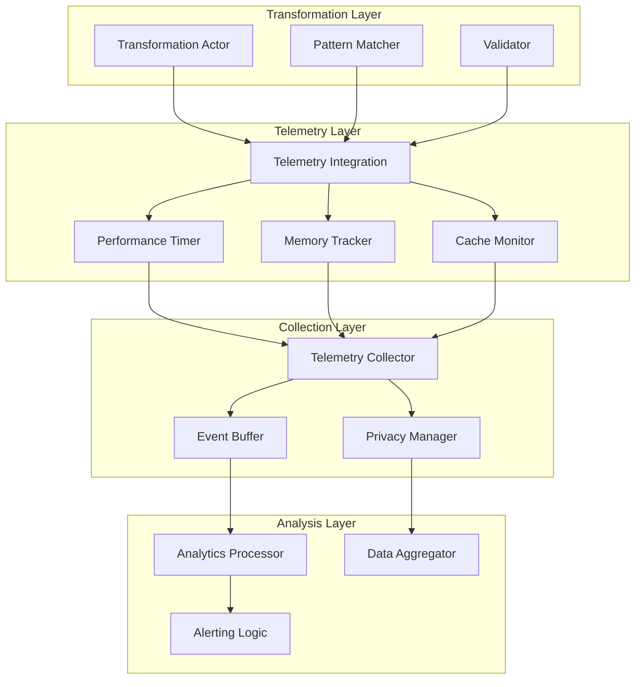

# Telemetry System Implementation Guide

## Overview

This document provides implementation guidance for the comprehensive telemetry system designed for Carmack Coder. The system follows spike-driven development principles and provides high-signal, low-overhead observability.

## Quick Start

### Basic Integration

```typescript
import { initializeTelemetry, createTransformationTelemetry } from '../src/telemetry/index.js';

// Initialize telemetry system
const collector = initializeTelemetry({
  enabled: true,
  performanceSampleRate: 0.1, // 10% sampling
  behaviorSampleRate: 1.0,    // 100% behavior tracking
});

// Create telemetry for a transformation
const transformationId = 'unique-id';
const telemetry = createTransformationTelemetry(
  transformationId,
  'ast',
  'src/example.ts', 
  originalCode
);

// Track transformation pipeline
telemetry.startTransformation();
telemetry.recordPatternSuccess('var-to-const');
telemetry.completeParsing();
telemetry.completePatternMatching();
telemetry.completeTransformationStage();
telemetry.completeValidation();
await telemetry.completeTransformation(transformedCode, 3);
```

### CLI Integration

```typescript
// In your CLI handler
import { getTelemetryCollector } from '../src/telemetry/index.js';

const collector = getTelemetryCollector();
const sessionId = collector.startSession(userId);

// Record user mode selection
collector.recordModeSelection([
  { mode: 'ast', fileType: 'ts', complexity: 5, outcome: 'success', timestamp: Date.now(), duration: 2000 }
], 10000);
```

## Architecture

### Event Flow



## Metric Specifications

### TEL-001: Pattern Success Rate
**Purpose**: Track transformation pattern effectiveness  
**Collection**: Per pattern application  
**Impact**: Identifies reliable vs problematic patterns  

```typescript
interface PatternSuccessMetric {
  id: 'TEL-001';
  patternId: string;
  successCount: number;
  failureCount: number;
  successRate: number;
  mode: 'template' | 'ast' | 'llm';
  filePath: string;
  errorReason?: string;
}
```

### TEL-004: Transformation Latency
**Purpose**: Measure performance across pipeline stages  
**Collection**: Sampled (10% default)  
**Impact**: Identifies performance bottlenecks  

```typescript
interface LatencyMetric {
  id: 'TEL-004';
  transformationId: string;
  mode: TransformationMode;
  fileSizeBytes: number;
  pipelineStages: {
    parsing: number;
    patternMatching: number;
    transformation: number;
    validation: number;
    serialization: number;
  };
  totalLatency: number;
  percentile: 'p50' | 'p95' | 'p99';
}
```

### TEL-007: Mode Selection Patterns
**Purpose**: Understand user behavior and preferences  
**Collection**: Session-based  
**Impact**: Guides UX improvements and feature prioritization  

```typescript
interface ModeSelectionMetric {
  id: 'TEL-007';
  sequence: Array<{
    mode: TransformationMode;
    fileType: string;
    complexity: number;
    outcome: 'success' | 'failure' | 'cancelled';
    timestamp: number;
    duration: number;
  }>;
  patterns: string[];
  sessionDuration: number;
  modeSwitches: number;
  dominantMode: TransformationMode;
}
```

## Implementation Examples

### Scenario 1: High-Frequency Small Files

```typescript
describe('High-frequency transformations', () => {
  test('should maintain <5% overhead at 1000 transformations', async () => {
    const collector = initializeTelemetry({ 
      performanceSampleRate: 1.0 // Full sampling for testing
    });
    
    const startTime = performance.now();
    
    for (let i = 0; i < 1000; i++) {
      const telemetry = createTransformationTelemetry(
        `transform-${i}`,
        'template',
        `file-${i}.ts`,
        smallFileCode
      );
      
      telemetry.startTransformation();
      telemetry.recordPatternSuccess('strict-equality');
      await telemetry.completeTransformation(transformedCode, 1);
    }
    
    const totalTime = performance.now() - startTime;
    const healthMetrics = collector.getHealthMetrics();
    
    expect(healthMetrics.performanceStats.overhead).toBeLessThan(5);
    expect(totalTime / 1000).toBeLessThan(50); // <50ms per transformation
  });
});
```

### Scenario 2: Error Recovery Tracking

```typescript
// In error handling code
try {
  const result = await applyTransformation(code, patterns);
} catch (error) {
  collector.recordErrorRecovery(
    error.type,
    error.code,
    error.message,
    [
      { action: 'retry', timestamp: Date.now(), success: false },
      { action: 'mode-switch', timestamp: Date.now() + 1000, success: true, newMode: 'ast' }
    ],
    1500, // Resolution time
    'resolved',
    'medium'
  );
}
```

### Scenario 3: Cache Performance Monitoring

```typescript
class ASTParseCache {
  private cache = new Map();
  private telemetry: CacheMonitor;
  
  constructor(telemetryIntegration: TransformationTelemetry) {
    this.telemetry = telemetryIntegration.getCacheMonitor();
  }
  
  get(key: string): any {
    const startTime = performance.now();
    const value = this.cache.get(key);
    const lookupTime = (performance.now() - startTime) * 1000; // microseconds
    
    if (value) {
      this.telemetry.recordHit('ast-parse', lookupTime);
      return value;
    } else {
      this.telemetry.recordMiss('ast-parse', lookupTime);
      return null;
    }
  }
  
  set(key: string, value: any): void {
    this.cache.set(key, value);
    this.telemetry.updateSize('ast-parse', this.cache.size, this.estimateMemoryUsage());
  }
}
```

## Performance Requirements

### Collection Overhead
- **Target**: <5% of total transformation time
- **Measurement**: Compare transformation time with/without telemetry
- **Mitigation**: Sampling, async processing, batching

### Memory Usage
- **Target**: <50MB additional memory usage
- **Measurement**: Process memory before/after telemetry initialization
- **Mitigation**: Event buffer limits, periodic cleanup, compression

### Storage Efficiency
- **Target**: 10:1 compression ratio for time-series data
- **Measurement**: Raw event size vs compressed storage
- **Mitigation**: Schema optimization, data aggregation, selective retention

## Privacy & Compliance

### Data Minimization
```typescript
const privacyConfig = {
  collectUserIds: false,     // Opt-in only
  collectFilePaths: true,    // Needed for debugging, sanitized
  collectSourceCode: false,  // Never collect actual code
  retentionDays: 90,         // Automatic cleanup
};
```

### Anonymization
```typescript
// User IDs are hashed with rotating salt
const anonymizedId = createHash('sha256')
  .update(userId + dailySalt)
  .digest('hex')
  .substring(0, 16);

// File paths are sanitized
const sanitizedPath = filePath.replace(/^.*[\\\/]/, '').replace(/[\\\/]/g, '/');
```

## Testing Strategy

### Validation Scenarios

1. **High-Frequency Small Files**: 1000 files <100 lines each
2. **Large File Processing**: Single 10,000+ line file  
3. **Error-Heavy Workload**: Intentional syntax/semantic errors
4. **Mixed-Mode Usage**: Users switching between template/AST/LLM modes

### Performance Benchmarks

```typescript
// Overhead validation
const baselineTime = measureTransformationWithoutTelemetry();
const telemetryTime = measureTransformationWithTelemetry();
const overhead = ((telemetryTime - baselineTime) / baselineTime) * 100;
expect(overhead).toBeLessThan(5);

// Memory validation  
const initialMemory = process.memoryUsage();
await runExtendedTelemetryOperations();
const finalMemory = process.memoryUsage();
const memoryGrowth = (finalMemory.heapUsed - initialMemory.heapUsed) / (1024 * 1024);
expect(memoryGrowth).toBeLessThan(50); // <50MB growth
```

### Signal Quality Metrics

- **Signal-to-Noise Ratio**: >80% of events lead to actionable insights
- **False Positive Rate**: <5% for automated alerts
- **Data Completeness**: >99% of user sessions tracked end-to-end  
- **Metric Correlation**: >0.7 correlation between productivity metrics and satisfaction

## Deployment Considerations

### Development Environment
```typescript
const devConfig = {
  enabled: true,
  performanceSampleRate: 1.0, // Full sampling for debugging
  behaviorSampleRate: 1.0,
  batchSize: 10,              // Immediate feedback
  flushInterval: 1000,
};
```

### Production Environment
```typescript
const prodConfig = {
  enabled: true,
  performanceSampleRate: 0.1, // 10% sampling for efficiency
  behaviorSampleRate: 1.0,    // Full behavior tracking
  batchSize: 100,
  flushInterval: 5000,
  privacy: {
    collectUserIds: false,    // Privacy-first
    retentionDays: 90,
  },
};
```

### Monitoring & Alerting

#### Critical Alerts
- Telemetry system failure (data loss prevention)
- Performance degradation >10% (user experience protection)
- Privacy compliance violations (regulatory protection)

#### Health Checks
- Collection pipeline status
- Metric calculation accuracy
- Storage system performance  
- User opt-out rate tracking

## Success Metrics

### Short-term (30 days)
- [ ] All core metrics collecting successfully
- [ ] <3% performance overhead measured
- [ ] Zero data privacy incidents
- [ ] First actionable insights generated

### Medium-term (90 days)
- [ ] User behavior patterns identified
- [ ] Pattern effectiveness ranking established
- [ ] 2+ performance optimizations implemented
- [ ] Developer productivity gains measurable

### Long-term (180 days)
- [ ] Business ROI demonstrable
- [ ] Telemetry-driven feature prioritization
- [ ] Pattern adoption lifecycle tracked
- [ ] User satisfaction correlation established

## Next Steps

1. **Spike 1**: Implement core telemetry infrastructure (3 days)
2. **Spike 2**: Add performance monitoring integration (2 days)  
3. **Spike 3**: Connect quality metrics with Dafny verification (4 days)
4. **Spike 4**: Implement user behavior analytics (3 days)
5. **Spike 5**: Add business impact measurement (5 days)

Each spike includes comprehensive testing and validation before proceeding to the next phase.
