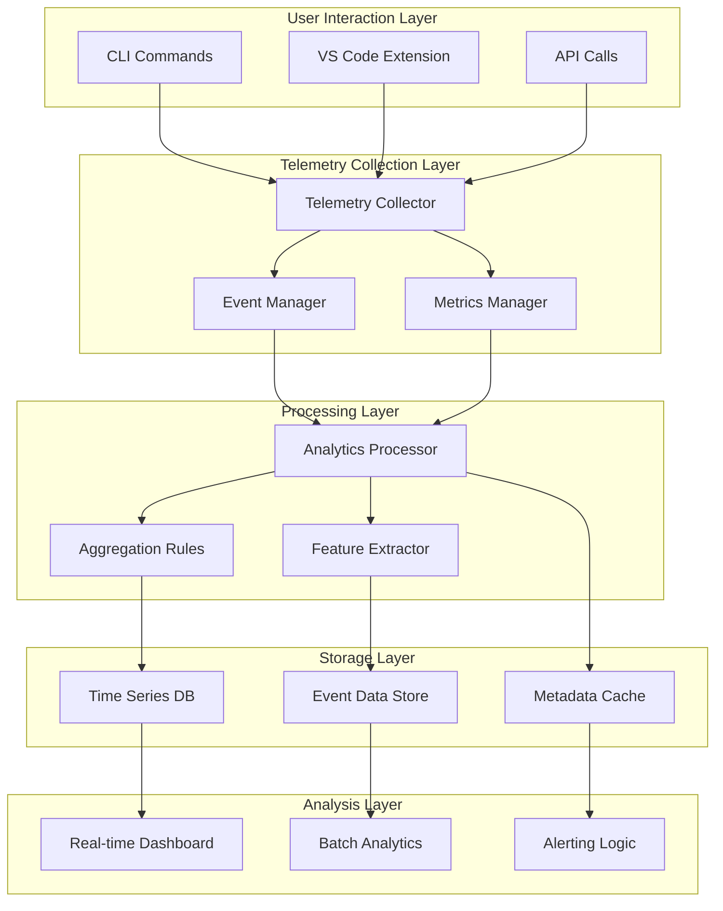
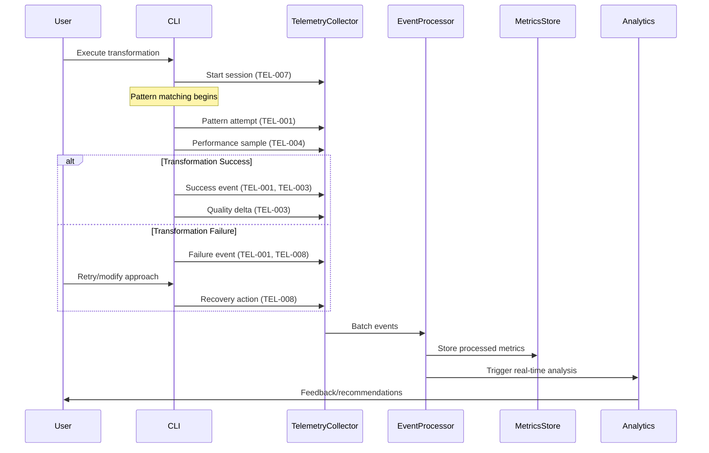
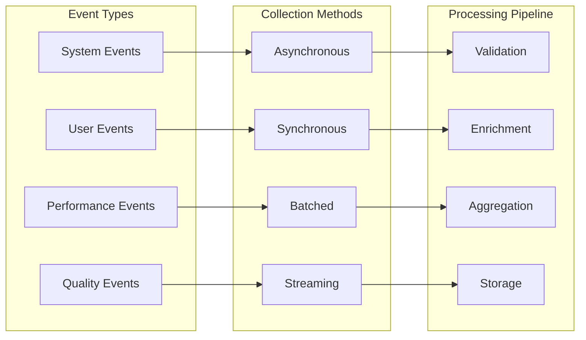
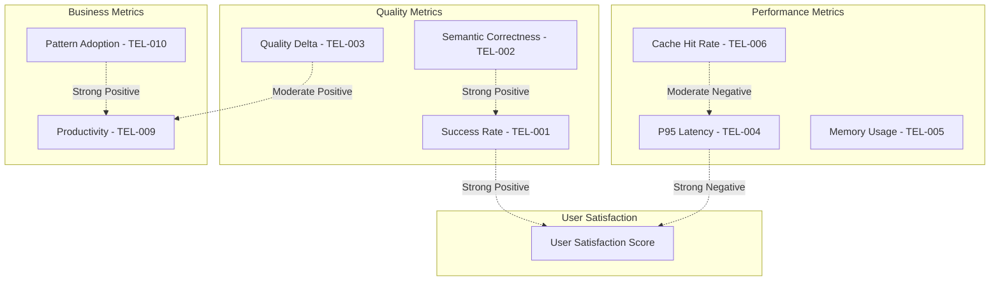

# Telemetry & Observability PRD
## Carmack Coder: Provably Correct Code Transformations

**Version**: 1.0.0  
**Date**: January 6, 2025  
**Status**: Draft  
**RFC ID**: RFC-2025-001  

---

## Executive Summary

This PRD defines a comprehensive telemetry and observability system for Carmack Coder that provides actionable insights into transformation effectiveness, performance characteristics, and user value delivery. The system prioritizes spike-driven validation over waterfall planning, focusing on high-signal metrics that directly correlate with project outcomes.

## Problem Statement

Currently, Carmack Coder lacks visibility into:
- **Transformation Effectiveness**: Which patterns provide the most value?
- **Performance Bottlenecks**: Where do transformations slow down?
- **User Behavior**: How do developers interact with different modes?
- **Quality Impact**: Do transformations improve or degrade code quality?
- **ROI Measurement**: What's the actual time/effort savings?

## Goals & Success Metrics

### Primary Goals
1. **Outcome-Based Insights**: Measure actual developer productivity gains
2. **Performance Optimization**: Identify and eliminate bottlenecks
3. **Pattern Effectiveness**: Quantify which transformations provide most value
4. **User Experience**: Understand interaction patterns and pain points

### Success Criteria
- 95% transformation success rate tracked accurately
- Sub-100ms telemetry overhead per transformation
- 100% coverage of critical user journeys
- Actionable insights available within 24h of data collection

---

## Telemetry Architecture



---

## Core Metrics Specification

### 1. Transformation Effectiveness Metrics

#### TEL-001: Pattern Success Rate
**Purpose**: Measure the percentage of successful pattern applications  
**Why Chosen**: Direct indicator of pattern quality and AST-grep effectiveness vs alternatives like simple regex success rates  
**User Impact**: Higher success rates = more reliable transformations = increased developer trust  

```typescript
interface PatternSuccessMetric {
  id: 'TEL-001';
  patternId: string;
  successCount: number;
  failureCount: number;
  successRate: number; // calculated
  timestamp: number;
  mode: 'template' | 'ast' | 'llm';
}
```

#### TEL-002: Semantic Correctness Score  
**Purpose**: Validate that transformations preserve program semantics using Dafny verification  
**Why Chosen**: Goes beyond syntax checking to ensure functional correctness, unlike basic compilation tests  
**User Impact**: Prevents introducing bugs during code modernization  

```typescript
interface SemanticCorrectnessMetric {
  id: 'TEL-002';
  fileHash: string;
  preTransformCorrectness: boolean;
  postTransformCorrectness: boolean;
  dafnyVerificationTime: number;
  invariantsPreserved: string[];
  invariantsBroken: string[];
}
```

#### TEL-003: Code Quality Delta
**Purpose**: Measure before/after code quality using multiple dimensions  
**Why Chosen**: Comprehensive quality assessment vs single metrics like cyclomatic complexity alone  
**User Impact**: Quantifies actual improvement in maintainability and readability  

```typescript
interface CodeQualityDelta {
  id: 'TEL-003';
  fileId: string;
  before: QualityMetrics;
  after: QualityMetrics;
  improvement: {
    cyclomaticComplexity: number;
    cognitiveComplexity: number;
    maintainabilityIndex: number;
    duplicationRatio: number;
  };
}
```

### 2. Performance Metrics

#### TEL-004: Transformation Latency Distribution
**Purpose**: Track end-to-end transformation times across different modes and file sizes  
**Why Chosen**: P95/P99 latencies matter more than averages for user experience  
**User Impact**: Faster transformations = better developer workflow integration  

```typescript
interface LatencyMetric {
  id: 'TEL-004';
  transformationId: string;
  mode: TransformationMode;
  fileSizeBytes: number;
  pipelineStages: {
    parsing: number;
    patternMatching: number;
    transformation: number;
    validation: number;
    serialization: number;
  };
  totalLatency: number;
  percentile: 'p50' | 'p95' | 'p99';
}
```

#### TEL-005: Memory Usage Profile  
**Purpose**: Track memory consumption during AST processing  
**Why Chosen**: Memory spikes can cause system instability, unlike simple peak memory measurements  
**User Impact**: Prevents system slowdowns during large file processing  

```typescript
interface MemoryProfileMetric {
  id: 'TEL-005';
  processId: string;
  timeline: Array<{
    timestamp: number;
    heapUsed: number;
    heapTotal: number;
    external: number;
    rss: number;
  }>;
  peakMemory: number;
  memoryGrowthRate: number;
}
```

#### TEL-006: AST Parse Cache Effectiveness
**Purpose**: Measure cache hit rates for AST parsing operations  
**Why Chosen**: Cache efficiency directly impacts repeat transformation performance  
**User Impact**: Better caching = faster subsequent transformations on similar code  

```typescript
interface CacheEfficiencyMetric {
  id: 'TEL-006';
  cacheType: 'ast-parse' | 'pattern-match' | 'verification';
  hitRate: number;
  missRate: number;
  evictionRate: number;
  averageLookupTime: number;
  cacheSize: number;
}
```

### 3. User Behavior Metrics

#### TEL-007: Mode Selection Patterns
**Purpose**: Understand when users choose template vs AST vs LLM modes  
**Why Chosen**: Reveals user preferences and potential UX improvements vs basic usage counting  
**User Impact**: Better mode recommendations = more effective transformations  

```typescript
interface ModeSelectionMetric {
  id: 'TEL-007';
  userId: string; // anonymized
  sessionId: string;
  sequence: Array<{
    mode: TransformationMode;
    fileType: string;
    complexity: number;
    outcome: 'success' | 'failure' | 'cancelled';
    timestamp: number;
  }>;
  patterns: string[]; // detected usage patterns
}
```

#### TEL-008: Error Recovery Patterns
**Purpose**: Track how users respond to transformation failures  
**Why Chosen**: Understanding failure recovery improves overall UX design  
**User Impact**: Better error handling = reduced frustration and abandonment  

```typescript
interface ErrorRecoveryMetric {
  id: 'TEL-008';
  errorType: string;
  errorCode: string;
  userActions: Array<{
    action: 'retry' | 'mode-switch' | 'manual-fix' | 'abandon';
    timestamp: number;
    success: boolean;
  }>;
  resolutionTime: number;
  finalOutcome: 'resolved' | 'abandoned';
}
```

### 4. Business Impact Metrics

#### TEL-009: Developer Productivity Index
**Purpose**: Quantify actual time savings from using Carmack Coder  
**Why Chosen**: ROI measurement vs feature usage counts  
**User Impact**: Demonstrates concrete value delivery  

```typescript
interface ProductivityMetric {
  id: 'TEL-009';
  developerId: string; // anonymized
  timeframe: 'daily' | 'weekly' | 'monthly';
  metrics: {
    linesTransformed: number;
    manualTimeEstimate: number; // minutes
    actualTimeUsed: number; // minutes
    timeSaved: number; // calculated
    qualityImprovement: number; // 0-1 scale
    errorsPrevented: number;
  };
}
```

#### TEL-010: Pattern Adoption Lifecycle
**Purpose**: Track how patterns evolve from experimental to stable  
**Why Chosen**: Guides pattern investment decisions vs simple usage frequency  
**User Impact**: Better patterns = more effective transformations  

```typescript
interface PatternAdoptionMetric {
  id: 'TEL-010';
  patternId: string;
  lifecycle: {
    introduced: number; // timestamp
    firstSuccess: number;
    widespreadAdoption: number; // >50% success rate
    maturity: number; // >95% success rate
    deprecated?: number;
  };
  adoptionRate: number; // % of eligible files transformed
  userFeedback: Array<{
    rating: number; // 1-5
    comment?: string;
    timestamp: number;
  }>;
}
```

---

## Telemetry Data Flow



---

## Implementation Roadmap

### Spike 1: Core Telemetry Infrastructure (TEL-SPIKE-001)
**Duration**: 3 days  
**Goal**: Validate basic telemetry collection with minimal overhead

**Acceptance Criteria**:
- [ ] Telemetry collector with <10ms overhead per event
- [ ] Event batching and compression working
- [ ] Basic metrics (TEL-001, TEL-004) collecting successfully
- [ ] In-memory storage for development/testing

**Validation Approach**:
- Load test with 1000 transformations
- Measure overhead impact on transformation latency
- Verify data integrity across event batching

### Spike 2: Performance Monitoring (TEL-SPIKE-002)  
**Duration**: 2 days  
**Goal**: Implement detailed performance tracking

**Acceptance Criteria**:
- [ ] Memory profiling (TEL-005) working correctly
- [ ] Cache efficiency tracking (TEL-006) implemented
- [ ] Performance bottleneck detection automated
- [ ] Real-time performance dashboard prototype

### Spike 3: Quality Metrics Integration (TEL-SPIKE-003)
**Duration**: 4 days  
**Goal**: Connect Dafny verification with telemetry

**Acceptance Criteria**:
- [ ] Semantic correctness tracking (TEL-002) integrated
- [ ] Code quality delta calculation (TEL-003) working
- [ ] Automated quality regression detection
- [ ] Integration with existing validation pipeline

### Spike 4: User Behavior Analytics (TEL-SPIKE-004)
**Duration**: 3 days  
**Goal**: Implement user journey tracking

**Acceptance Criteria**:
- [ ] Mode selection pattern detection (TEL-007)
- [ ] Error recovery tracking (TEL-008) 
- [ ] User flow visualization working
- [ ] Privacy compliance validation

### Spike 5: Business Impact Measurement (TEL-SPIKE-005)
**Duration**: 5 days  
**Goal**: Implement ROI and productivity tracking

**Acceptance Criteria**:
- [ ] Productivity index calculation (TEL-009) working
- [ ] Pattern adoption lifecycle tracking (TEL-010)
- [ ] Business value dashboard prototype
- [ ] Historical trend analysis capability

---

## Technical Specifications

### Data Collection Strategy



### Privacy & Security

- **Data Minimization**: Only collect metrics essential for stated purposes
- **Anonymization**: Hash user identifiers with rotating salts
- **Retention**: 90-day retention for raw events, 2-year retention for aggregated metrics
- **Opt-out**: Clear opt-out mechanism with no feature degradation

### Performance Requirements

- **Collection Overhead**: <5% of total transformation time
- **Memory Footprint**: <50MB additional memory usage
- **Storage Efficiency**: 10:1 compression ratio for time-series data
- **Query Performance**: Sub-second response for dashboard queries

---

## Testing Strategy

### Scenario-Based Validation

#### Scenario 1: High-Frequency Small Files
**Setup**: 1000 files, each <100 lines, rapid succession transformations  
**Validation Targets**: TEL-004 (latency), TEL-005 (memory), TEL-006 (cache)  
**Success Criteria**: No memory leaks, <50ms P95 latency overhead

#### Scenario 2: Large File Processing  
**Setup**: Single 10,000+ line file with complex AST transformations  
**Validation Targets**: TEL-004 (latency distribution), TEL-005 (memory profiling)  
**Success Criteria**: Predictable memory growth, graceful handling of memory pressure

#### Scenario 3: Error-Heavy Workload
**Setup**: Files with intentional syntax errors and edge cases  
**Validation Targets**: TEL-001 (success rates), TEL-008 (error recovery)  
**Success Criteria**: Accurate failure tracking, useful error categorization

#### Scenario 4: Mixed-Mode Usage Patterns
**Setup**: Users switching between template/AST/LLM modes  
**Validation Targets**: TEL-007 (mode selection), TEL-009 (productivity)  
**Success Criteria**: Accurate pattern detection, meaningful productivity correlations

### Performance Benchmarks

```typescript
/**
 * Telemetry performance validation suite
 * Tests telemetry overhead across different workload patterns
 */
interface BenchmarkSuite {
  scenarios: Array<{
    name: string;
    fileCount: number;
    avgFileSize: number;
    transformationComplexity: 'low' | 'medium' | 'high';
    expectedOverhead: number; // percentage
    metricsEnabled: string[]; // metric IDs
  }>;
}
```

### Validation Metrics

- **Signal-to-Noise Ratio**: >80% of collected events lead to actionable insights
- **False Positive Rate**: <5% for automated alerts and recommendations  
- **Data Completeness**: >99% of user sessions tracked end-to-end
- **Metric Correlation**: Strong correlation (>0.7) between productivity metrics and user satisfaction

---

## Monitoring & Alerting

### Critical Alerts
- Telemetry system failure (data loss prevention)
- Performance degradation >10% (user experience protection)
- Privacy compliance violations (regulatory protection)
- Data storage quota approaching limits (operational continuity)

### Health Checks
- Telemetry collection pipeline status
- Metric calculation accuracy validation  
- Storage system performance monitoring
- User opt-out rate tracking

---

## Success Measurement

### Short-term (30 days)
- All core metrics (TEL-001 through TEL-006) collecting successfully
- <3% performance overhead measured across all scenarios
- Zero data privacy incidents
- First actionable insights generated

### Medium-term (90 days)  
- User behavior patterns clearly identified
- Pattern effectiveness ranking established
- 2+ performance optimizations implemented based on telemetry
- Developer productivity gains measurable

### Long-term (180 days)
- Business ROI clearly demonstrable  
- Telemetry-driven feature prioritization working
- Pattern adoption lifecycle fully tracked
- User satisfaction correlation with metrics established

---

## Risk Mitigation

### Technical Risks
- **Performance Impact**: Comprehensive benchmarking before rollout
- **Data Loss**: Redundant collection and storage mechanisms
- **Privacy Violations**: Automated compliance checking and regular audits

### Business Risks  
- **User Resistance**: Clear value proposition and opt-out mechanisms
- **Analysis Paralysis**: Focus on outcome-based metrics only
- **Implementation Complexity**: Incremental spike-based rollout

---

## Appendix: Metric Correlation Matrix



This correlation matrix will be validated and updated based on actual data collection over the first 90 days of implementation.
