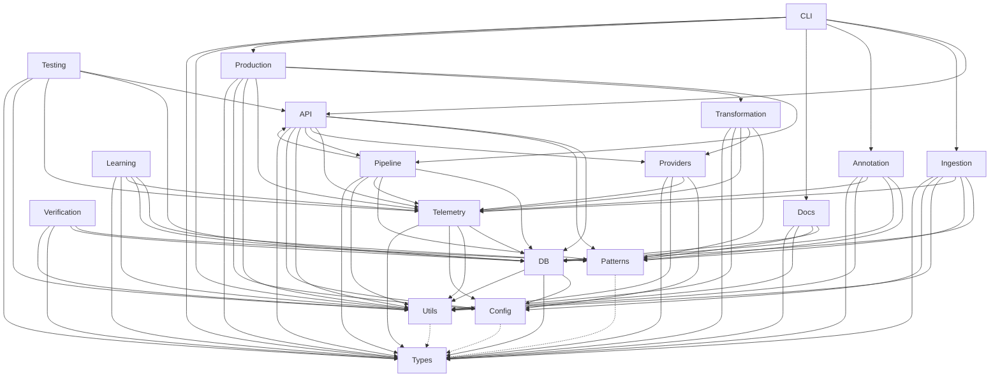

# Modular Architecture: Module Dependencies and Interactions

## Module Dependency Table

| Module         | Depends On                                      |
|----------------|-------------------------------------------------|
| API            | DB, Patterns, Telemetry, Providers, Pipeline, Utils, Config, Types |
| Ingestion      | DB, Patterns, Telemetry, Utils, Config, Types   |
| Learning       | Patterns, DB, Telemetry, Utils, Types           |
| Annotation     | Patterns, DB, Telemetry, Utils, Types           |
| Docs           | DB, Patterns, Utils, Types                      |
| DB             | Config, Types, Utils                            |
| Patterns       | (Data only; used by most modules)               |
| Telemetry      | DB, Utils, Config, Types                        |
| Testing        | API, DB, Telemetry, Utils, Types                |
| Types          | (Shared by all modules)                         |
| Utils          | (Shared by all modules)                         |
| Verification   | Patterns, DB, Types, Utils                      |
| Config         | (Shared by all modules)                         |
| Providers      | Config, Telemetry, Utils, Types                 |
| Pipeline       | API, DB, Patterns, Telemetry, Utils, Types      |
| Transformation | Patterns, Providers, Telemetry, Utils, Types    |
| Production     | Pipeline, Transformation, Telemetry, Utils, Config, Types |
| CLI            | API, Ingestion, Annotation, Docs, Production, Utils, Types |

## Mermaid Diagram

- Solid arrows: direct dependencies
- Dashed arrows: shared foundational types/utilities

---
Next: summarize how this architecture supports loose coupling, testability, and extensibility.